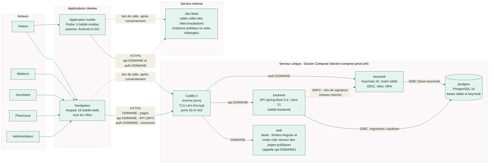

# Tabibi : infrastructure et documentation

> **Pourquoi ce document.** C'est la porte d'entrée du projet Tabibi v2 : ce qu'est la plateforme, où sont les
> dépôts, quels documents lire, comment tout lancer en dix minutes, où en est chaque dépôt et ce qu'il reste à faire.
> Il s'adresse d'abord à un développeur qui rejoint l'équipe.

**Tabibi** est une plateforme de prise de rendez-vous médicaux en Algérie, reconstruite de façon professionnelle :
API Spring Boot (architecture hexagonale), front web Angular, application mobile Flutter pour les patients,
identité Keycloak, base PostgreSQL, tout conteneurisé et déployable sur un seul serveur. Cinq rôles : patient,
médecin, secrétaire, pharmacie, administrateur.



## Carte des dépôts

| Dépôt | Rôle | Pile | Avancement |
|---|---|---|---|
| [`tabibi-backend`](https://github.com/<org>/tabibi-backend) | API métier, orchestration de production (`docker-compose.prod.yml`, `infra/`) | Spring Boot 3.4.1 / Java 21, Spring Security + Keycloak JWT, JPA, Liquibase, PostgreSQL 16 | v0.22.0, 23 commits, 17 modules, 16 changelogs, 50 classes de test |
| [`tabibi-web`](https://github.com/<org>/tabibi-web) | Front web, tous les rôles | Angular 18.2 (standalone, signaux, SSR), angular-oauth2-oidc, Karma / Jasmine, image Node | v0.19.0, 20 commits, 271 specs |
| [`tabibi-mobile`](https://github.com/<org>/tabibi-mobile) | Application patient Android et iOS | Flutter 3 (Dart >= 3.5), flutter_appauth, http | v0.13.0, 14 commits, CI avec APK |
| `tabibi-infra-docs` (ce dépôt) | Documentation vivante, environnement de dev, copie du realm Keycloak, diagrammes | Docker Compose, Keycloak 26, Mermaid | 24 diagrammes, 8 documents |

Remplacer `<org>` par l'organisation GitHub qui héberge les dépôts.

## Sommaire de la documentation

| Document | Contenu | À lire quand |
|---|---|---|
| [docs/ARCHITECTURE.md](docs/ARCHITECTURE.md) | principes, vue d'ensemble, architecture hexagonale, modules et dépendances, diagrammes de classes, modèle de données, sécurité, **tous les endpoints par rôle**, structure du web et du mobile, séquences, conventions | premier jour |
| [docs/CHOIX-TECHNIQUES.md](docs/CHOIX-TECHNIQUES.md) | chaque technologie : version, pourquoi, alternatives écartées ; ordres de prix d'hébergement ; stratégie « commencer petit, pouvoir changer » | pour comprendre les décisions, ou recruter |
| [docs/SECURITE.md](docs/SECURITE.md) | modèle de menace, mesures en place (tirées du code), durcissement Keycloak, secrets, reste à faire avant la production (loi 18-07, chiffrement, sauvegardes, pentest) | avant de toucher à la sécurité ou de déployer |
| [docs/DEPLOIEMENT.md](docs/DEPLOIEMENT.md) | guide pas à pas : VPS, DNS, `.env`, realm de production, `docker compose up`, vérifications, sauvegardes, mise à jour, journaux, évolution | pour mettre en ligne |
| [docs/GUIDE-DEVELOPPEUR.md](docs/GUIDE-DEVELOPPEUR.md) | installer, lancer, tester chaque dépôt ; ajouter une fonctionnalité (liste de contrôle) ; conventions de commit ; lire le journal ; regénérer les diagrammes | avant le premier commit |
| [docs/FONCTIONNALITES.md](docs/FONCTIONNALITES.md) | liste fonctionnelle par acteur avec, pour chaque fonctionnalité, les endpoints, la route web, l'écran mobile et le statut | pour savoir ce qui existe |
| [docs/JOURNAL.md](docs/JOURNAL.md) | journal global chronologique des trois dépôts (date, dépôt, version, hash, résumé) | pour retrouver quand et où une fonctionnalité est arrivée |
| [docs/architecture-cible.html](docs/architecture-cible.html) | la même architecture en une page HTML autonome avec les images, à ouvrir dans un navigateur ou à envoyer | pour présenter le projet |
| [CONTRIBUTING.md](CONTRIBUTING.md) | branches, pull requests, revue, CI verte, branche principale protégée | avant de contribuer |
| `docs/diagrammes/src/*.mmd`, `docs/images/*.png` | sources Mermaid et images générées (`docs/diagrammes/generer.sh`) | pour modifier un schéma |

## Démarrage rapide en dix minutes

Prérequis : Docker, JDK 21 et Maven 3.9, Node 20, Flutter (facultatif pour le mobile).

```bash
# 1. Cloner les quatre dépôts côte à côte
git clone https://github.com/<org>/tabibi-infra-docs.git
git clone https://github.com/<org>/tabibi-backend.git
git clone https://github.com/<org>/tabibi-web.git
git clone https://github.com/<org>/tabibi-mobile.git

# 2. PostgreSQL 16 + Keycloak 26 (realm tabibi importé avec les comptes de démonstration)
cd tabibi-infra-docs && docker compose up -d
#    Keycloak : http://localhost:8081 (admin / admin), PostgreSQL : localhost:5432 (tabibi / tabibi)

# 3. L'API (données en mémoire ; ajouter -Dspring-boot.run.profiles=postgres pour la base)
cd ../tabibi-backend && mvn spring-boot:run
#    http://localhost:8080/swagger-ui.html, http://localhost:8080/actuator/health

# 4. Le front web
cd ../tabibi-web && npm install && npm start
#    http://localhost:4200

# 5. L'application mobile (émulateur Android ; 10.0.2.2 désigne la machine hôte)
cd ../tabibi-mobile && flutter pub get && flutter run
```

Comptes de démonstration (développement local seulement, jamais en production) :

| Utilisateur | Mot de passe | Rôle | Essayer |
|---|---|---|---|
| `patient.demo` | `patient` | PATIENT | réserver un créneau du Dr Amina Belkacem, écrire au médecin, demander un médicament (Dawini) |
| `medecin.demo` | `medecin` | MEDECIN | `/medecin/agenda` : honorer, proposer une téléconsultation, rédiger une ordonnance |
| `secretaire.demo` | `secretaire` | SECRETAIRE | après rattachement par `medecin.demo` (`/medecin/secretaires`) : `/secretaire` |
| `pharmacie.demo` | `pharmacie` | PHARMACIE | `/pharmacie` : répondre aux demandes de la wilaya 16 |
| `admin.demo` | `admin` | ADMIN | `/admin` : candidatures, modération des avis, rappels |

Jeton en ligne de commande (dev seulement) :

```bash
curl -s -X POST http://localhost:8081/realms/tabibi/protocol/openid-connect/token \
  -d client_id=tabibi-web -d grant_type=password -d username=patient.demo -d password=patient \
  | python3 -c 'import json,sys; print(json.load(sys.stdin)["access_token"])'
```

Tester : `mvn test` (backend), `npx ng test --watch=false --browsers=ChromeHeadlessCI` (web),
`flutter test` (mobile). Détails dans [docs/GUIDE-DEVELOPPEUR.md](docs/GUIDE-DEVELOPPEUR.md).

## État d'avancement

Hash = commit qui a livré la fonctionnalité (voir [docs/JOURNAL.md](docs/JOURNAL.md)).

| Fonctionnalité | Backend | Web | Mobile (patient) |
|---|---|---|---|
| Socle : connexion Keycloak, JWT, rôles, `/api/moi` | v0.1.0 `8cf3134` | v0.1.0 `c86810d` | v0.1.0 `053f2de` |
| Persistance JPA / PostgreSQL + Liquibase | v0.2.0 `61d07fd` | — | — |
| Annuaire : recherche publique de praticiens | v0.3.0 `5e3ae9a` | v0.2.0 `d54e169` | v0.2.0 `8bd6b73` |
| Créneaux et fiche du praticien | v0.4.0 `252ad14` | v0.3.0 `6ebf00b` | v0.3.0 `c970f87` |
| Réserver, mes rendez-vous, annuler | v0.5.0 `ad63b7b` (+ v0.5.1 `1fa03d9`) | v0.3.0 `6ebf00b` | v0.3.0 `c970f87` |
| Ordonnances : rédaction, consultation, vérification publique | v0.6.0 `65abf35` | v0.4.0 `167e6b5` | v0.4.0 `0f6c3ba` |
| Espace médecin : agenda, honorer, créneaux, ordonnances rédigées | v0.7.0 `53a65ee` | v0.5.0 `cb9dda4` | hors périmètre |
| Notifications internes, port `Notifieur` | v0.8.0 `1bd2d65` | v0.6.0 `312b010` | v0.5.0 `4f1d143` |
| Téléconsultation Jitsi avec consentement | v0.9.0 `7efc917` | v0.7.0 `61fe225` | v0.6.0 `cef96cb` |
| Administration : candidatures des médecins, statistiques | v0.10.0 `6ade583` | v0.8.0 `6ca7b2b` | hors périmètre |
| Messagerie patient-médecin | v0.11.0 `1ddc48a` | v0.9.0 `852199c` | v0.7.0 `47c7539` |
| Avis vérifiés, synthèse publique, modération | v0.12.0 `e9e96f2` | v0.10.0 `ad6b213` | v0.8.0 `35453ee` |
| Dawini : besoins de médicaments et pharmacies | v0.13.0 `1f23e39` | v0.11.0 `49cd6ec` | v0.9.0 `a7078c2` (+ v0.9.1 `341fc5c`) |
| Profil de l'utilisateur | v0.14.0 `5e82ed1` | v0.13.0 `b427a4d` | v0.11.0 `8fc3667` |
| Liste d'attente et alerte de créneau libéré | v0.15.0 `4eccf80` | v0.14.0 `b745b21` | v0.12.0 `9f3cc3c` |
| Cabinet : secrétaires, espace secrétaire, annulation par le cabinet | v0.16.0 `9e9f6d0` | v0.15.0 `11d34ef` | hors périmètre |
| Rappels de rendez-vous 24 h avant | v0.17.0 `a860191` | v0.16.0 `bccea88` | (reçus en notification) |
| Configuration par environnement (API, Keycloak) | variables d'environnement dès v0.1.0 | v0.12.0 `9417001` | v0.10.0 `6f5d39a` |
| CORS configurable | v0.18.0 `acca60a` | — | — |
| Journal des accès à l'API | v0.19.0 `e412bae` | pas d'écran | — |
| Image Docker de production, orchestration Compose, Caddy, sauvegardes | v0.20.0 `3e8c786` | v0.17.0 `92bcfa7` | — |
| CI : publication sur GHCR, Dependabot | v0.21.0 `1de20fb` | v0.18.0 `40410ff` | v0.13.0 `40bc155` (APK, stores) |
| Durcissement du realm Keycloak, realm de production | v0.22.0 `ae58723` | — | — |
| Rendu côté serveur des pages publiques (SSR) | — | v0.19.0 `fea168b` | — |

## Ce qu'il reste à faire

Détail et priorités dans [docs/SECURITE.md](docs/SECURITE.md) (section 5) et [docs/FONCTIONNALITES.md](docs/FONCTIONNALITES.md).

1. **Avant la production** : conformité loi 18-07 / RGPD (information, consentements, droits, localisation des
   données), chiffrement au repos et des sauvegardes, restauration testée, MFA imposée aux administrateurs et
   médecins, test d'intrusion, durcissement du serveur, transmission de `DOMAINE` au service `web` du compose de
   production, pousser sur la branche `main` (la CI ne publie les images que depuis `main`).
2. **Fonctionnel** : SMS / e-mail (adaptateurs du port `Notifieur`), nom du patient dans les écrans du cabinet,
   sélecteur de wilayas, écran du journal des accès, annulation d'une ordonnance, export et effacement d'un compte,
   purge du journal des accès.
3. **Mobile** : stockage sécurisé et rafraîchissement du jeton, notifications push, icône et écran de lancement,
   signature release depuis la CI, publication sur les stores.
4. **Plus tard** : titre et description par page pour le référencement, instance Jitsi dédiée, base managée puis plusieurs instances
   (voir [docs/DEPLOIEMENT.md](docs/DEPLOIEMENT.md)).

## Contenu de ce dépôt

```
README.md                      cette page
CONTRIBUTING.md                règles de contribution
docker-compose.yml             PostgreSQL 16 + Keycloak 26 pour le développement (identique à celui du backend)
infra/keycloak/tabibi-realm.json   copie du realm de développement (source de vérité : tabibi-backend)
docs/*.md                      les documents listés plus haut
docs/architecture-cible.html   la version HTML autonome
docs/diagrammes/src/*.mmd      sources Mermaid ; docs/diagrammes/generer.sh les regénère
docs/images/*.png, *.svg       les images générées (24 diagrammes)
```
