# Architecture de Tabibi v2

> **Pourquoi ce document.** Il décrit, avec des schémas, ce qu'est la plateforme (vue fonctionnelle), comment elle
> est construite (vue technique) et où se trouve chaque chose dans les trois dépôts de code. C'est le premier
> document à lire pour un développeur qui rejoint le projet ; les choix de technologies sont justifiés à part dans
> [CHOIX-TECHNIQUES.md](CHOIX-TECHNIQUES.md), la sécurité est détaillée dans [SECURITE.md](SECURITE.md).
> Tout ce qui est écrit ici est tiré du code des dépôts `tabibi-backend`, `tabibi-web` et `tabibi-mobile` à la date
> du 19 septembre 2026 ; les diagrammes sont générés depuis `docs/diagrammes/src` (Mermaid).

## Sommaire

1. [Principes](#1-principes)
2. [Vue d'ensemble](#2-vue-densemble)
3. [Architecture hexagonale du backend](#3-architecture-hexagonale-du-backend)
4. [Modules et dépendances](#4-modules-et-dépendances)
5. [Diagrammes de classes](#5-diagrammes-de-classes)
6. [Modèle de données](#6-modèle-de-données)
7. [Sécurité](#7-sécurité)
8. [API : tous les endpoints par rôle](#8-api--tous-les-endpoints-par-rôle)
9. [Front web (Angular)](#9-front-web-angular)
10. [Application mobile (Flutter)](#10-application-mobile-flutter)
11. [Parcours clés (séquences)](#11-parcours-clés-séquences)
12. [Conventions](#12-conventions)

## 1. Principes

| Principe | Ce que cela veut dire concrètement |
|---|---|
| **Sécurité d'abord** | Les données manipulées sont des données de patients. L'identité est déléguée à Keycloak (OIDC, PKCE, MFA possible), l'API valide un JWT à chaque requête, l'autorisation se joue côté serveur (rôle puis règle de propriétaire), les journaux et les notifications ne contiennent jamais de donnée de santé. |
| **Portabilité** | JPA + Liquibase (base remplaçable), tout est conteneurisé (hébergeur remplaçable), configuration par variables d'environnement, aucune dépendance à un service propriétaire. |
| **Testabilité** | Chaque fonctionnalité arrive avec ses tests : domaine, service, tranche web (401 / 403 / codes HTTP), intégration PostgreSQL (Testcontainers), specs Angular, tests Flutter. |
| **Clarté** | Architecture hexagonale, un module par domaine métier, nommage en français, un commit par fonctionnalité, journal tenu dans chaque dépôt. |
| **Progressivité** | On construit fonctionnalité par fonctionnalité, on déploie sur un serveur unique, on peut grandir sans réécrire (voir [DEPLOIEMENT.md](DEPLOIEMENT.md)). |

## 2. Vue d'ensemble


**Acteurs.** Cinq rôles portés par Keycloak : `PATIENT`, `MEDECIN`, `SECRETAIRE`, `PHARMACIE`, `ADMIN`.
Le **patient** cherche un praticien, réserve, consulte ses ordonnances, ses téléconsultations, sa messagerie, dépose
des avis, demande un médicament aux pharmacies (Dawini), s'inscrit sur une liste d'attente. Le **médecin** tient son
agenda, ouvre des créneaux, rédige des ordonnances, propose des téléconsultations, candidate à l'annuaire, rattache
des secrétaires. La **secrétaire** agit sur l'agenda des médecins qui l'ont rattachée. La **pharmacie** répond aux
besoins de médicaments de sa wilaya. L'**administrateur** valide les candidatures, modère les avis, déclenche les
rappels, consulte le journal des accès.

**Applications clientes.**
- `tabibi-web` : application Angular 18 (composants standalone) pour tous les rôles ; en production, un serveur
  Node (express + `@angular/ssr`) rend les pages publiques côté serveur et sert les fichiers, derrière Caddy.
- `tabibi-mobile` : application Flutter 3 (Android et iOS) destinée aux **patients** ; l'espace médecin, secrétaire,
  pharmacie et administrateur n'existe que sur le web.

**Serveur.** Un seul hôte Docker Compose (`docker-compose.prod.yml` du dépôt backend) : Caddy (TLS automatique),
`web` (Node, rendu côté serveur), `backend` (Spring Boot), `keycloak`, `postgres`. Seuls les ports 80 et 443 sont exposés ; les autres
services ne se parlent que sur le réseau interne. Les téléconsultations utilisent une salle Jitsi Meet (instance
publique par défaut, remplaçable par une instance auto-hébergée via `TABIBI_TELECONSULTATION_BASE_URL`).

**Trois noms DNS.** `DOMAINE` (front), `api.DOMAINE` (API), `auth.DOMAINE` (Keycloak).

## 3. Architecture hexagonale du backend

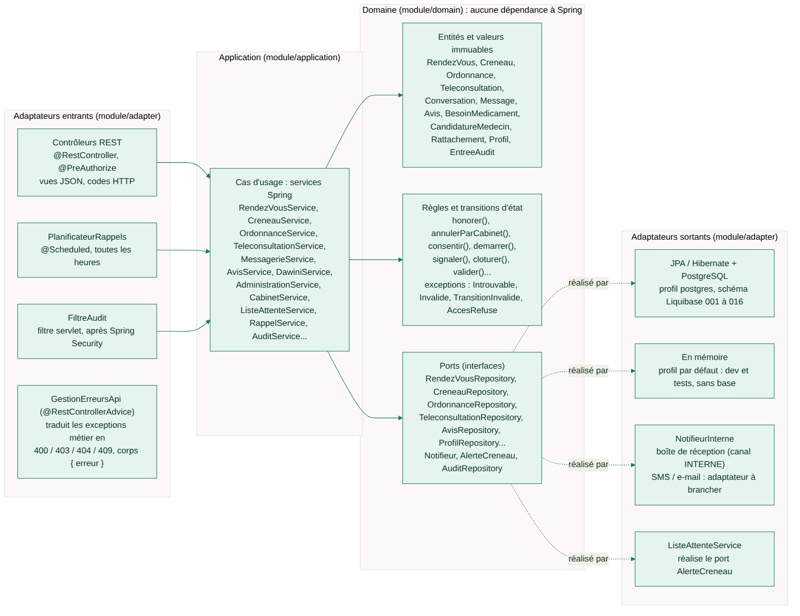

Chaque module du backend (`src/main/java/dz/tabibi/backend/<module>`) est découpé en trois paquets :

```
<module>/
  domain/        entités, valeurs immuables (records), règles et transitions d'état, exceptions métier,
                 PORTS (interfaces) : ce dont le domaine a besoin, sans dire comment
  application/   cas d'usage : services Spring (@Service) qui orchestrent le domaine à travers les ports
  adapter/       ADAPTATEURS : contrôleur REST (entrant), repositories en mémoire et JPA (sortants),
                 planificateur, filtre servlet, configuration Spring propre au module
```

Règles qui font tenir l'ensemble :

- **Le domaine ne dépend de rien** : aucune annotation Spring, aucune classe JPA dans `domain/`. Les entités
  portent leur comportement (`RendezVous.honorer()`, `Teleconsultation.demarrer()`, `Avis.signaler()`) et refusent
  les transitions interdites en levant `TransitionInvalideException` (409). Les valeurs sont des `record` immuables :
  changer un état produit une copie (`Creneau.reserver()`, `Message.marquerLu()`).
- **Un port, deux adaptateurs** : derrière chaque port de persistance il y a un adaptateur **en mémoire** (profil
  par défaut : aucune base requise pour développer et tester ; praticiens et créneaux de démonstration seedés) et un
  adaptateur **JPA / PostgreSQL** (profil `postgres`, schéma versionné par Liquibase, `ddl-auto: validate`).
- **Les modules se parlent par leurs ports**, jamais par leurs adaptateurs : `RendezVousService` prévient les
  utilisateurs via le port `Notifieur` (module notifications) et signale un créneau libéré via le port
  `AlerteCreneau` (module listeattente) sans connaître leurs réalisations.
- **Les erreurs métier deviennent des codes HTTP** en un seul endroit : `GestionErreursApi`
  (`@RestControllerAdvice`) traduit `*IntrouvableException` en 404, `*InvalideException` en 400,
  `TransitionInvalideException` et `CreneauDejaReserveException` en 409, `AccesRefuseException` en 403, toujours avec
  le corps `{ "erreur": "..." }`. Les refus de Spring Security (401, 403 par rôle) ne passent pas par là.
- **Le sujet du jeton (`sub`) est l'identifiant de l'utilisateur** : il vaut identifiant de patient, de médecin, de
  secrétaire ou de pharmacie selon le rôle ; il n'y a pas de table d'utilisateurs applicative (la table
  `utilisateur` du socle n'est utilisée par aucun module).

## 4. Modules et dépendances

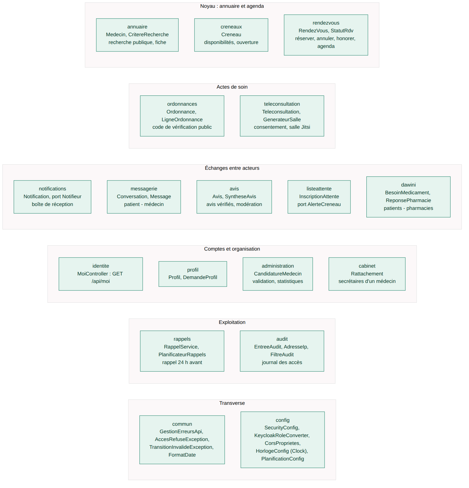

| Module | Rôle | Éléments notables |
|---|---|---|
| `annuaire` | Recherche publique de praticiens, fiche | `Medecin`, `CritereRecherche`, port `MedecinRepository` (`rechercher`, `parId`, `enregistrer`) |
| `creneaux` | Disponibilités et ouverture de créneaux | `Creneau` (record), `CreneauService.ouvrir` (futur, 5 à 120 min) |
| `rendezvous` | Réserver, annuler, honorer, agenda | `RendezVous`, `StatutRdv`, `RendezVousService`, annulation par le patient (idempotente) ou par le cabinet |
| `ordonnances` | Rédaction, consultation, vérification publique | `Ordonnance`, `LigneOrdonnance`, `CodeVerification` (8 caractères sans O/0/I/1), `ResultatVerification` |
| `teleconsultation` | Sessions vidéo Jitsi avec consentement | `Teleconsultation`, `GenerateurSalle` (`tabibi-` + 32 hexadécimaux), `TeleconsultationService.lienSalle` |
| `notifications` | Boîte de réception, port `Notifieur` | `Notification`, `CanalNotification` (INTERNE réalisé, SMS et EMAIL réservés), `NotifieurInterne` |
| `messagerie` | Conversations patient-médecin | `Conversation` (une par couple), `Message` (2000 caractères), lecture qui marque lu |
| `avis` | Avis vérifiés et modération | `Avis` (un par rendez-vous honoré), `StatutAvis`, `SyntheseAvis` anonymisée |
| `dawini` | Besoins de médicaments et réponses des pharmacies | `BesoinMedicament`, `ReponsePharmacie` (une par pharmacie et par besoin) |
| `listeattente` | Liste d'attente par médecin | `InscriptionAttente`, port `AlerteCreneau` réalisé par `ListeAttenteService` |
| `administration` | Candidatures des médecins, statistiques | `CandidatureMedecin`, `StatutCandidature`, validation qui publie dans l'annuaire |
| `cabinet` | Secrétaires rattachées à un médecin | `Rattachement`, `CabinetService` (agenda, créneaux, honorer, annuler **pour** un médecin) |
| `profil` | Profil de l'utilisateur connecté | `Profil` (nom, téléphone algérien, date de naissance, wilaya, langue fr / ar / kab / en) |
| `identite` | `GET /api/moi` | `MoiController` : sujet, nom, rôles du jeton |
| `rappels` | Rappel 24 h avant | `RappelService` (horloge injectée), `PlanificateurRappels` (`@Scheduled`, toutes les heures) |
| `audit` | Journal des accès | `EntreeAudit`, `AdresseIp` (troncature), `FiltreAudit`, `AuditConfig` |
| `commun` / `config` | Transverse | `GestionErreursApi`, `AccesRefuseException`, `TransitionInvalideException`, `FormatDate` (heure d'Algérie) ; `SecurityConfig`, `KeycloakRoleConverter`, `CorsProprietes`, `HorlogeConfig`, `PlanificationConfig` |

Les dépendances entre modules sont volontairement peu nombreuses et toujours dirigées vers un port ou un service
d'un module « plus central » (rendez-vous, notifications) ; il n'y a aucun cycle.

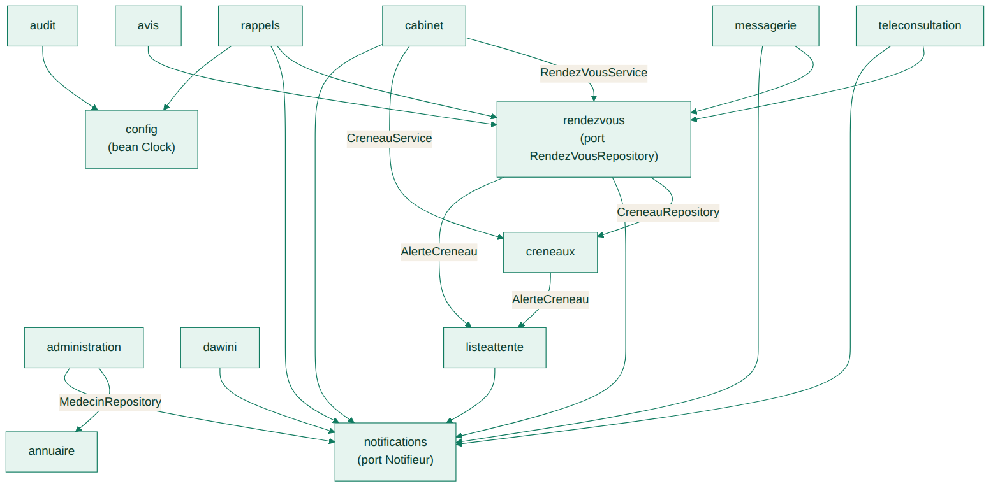

À retenir : toutes les flèches vers `notifications` passent par le port `Notifieur` ; toutes les flèches vers
`rendezvous` passent par le port `RendezVousRepository`, sauf `cabinet` qui réutilise `RendezVousService` (pour
bénéficier des règles d'annulation et des notifications). `creneaux` et `rendezvous` signalent un créneau libéré au
port `AlerteCreneau` sans connaître la liste d'attente.

## 5. Diagrammes de classes

Les diagrammes ci-dessous sont dessinés à partir des classes de `domain/` et `application/` (les entités JPA et les
adaptateurs en mémoire, purement techniques, n'y figurent que comme réalisations des ports).

### Rendez-vous et créneaux

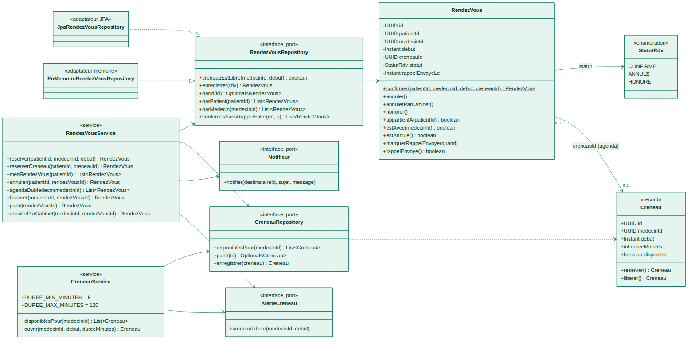

Cycle de vie d'un rendez-vous : `CONFIRME` à la réservation ; `ANNULE` par le patient (idempotent) ou par le cabinet
(seulement depuis `CONFIRME`) ; `HONORE` par le médecin ou la secrétaire (seulement depuis `CONFIRME`). Un rendez-vous
pris sur un créneau de l'agenda porte `creneauId` : l'annulation remet ce créneau à disposition et alerte la liste
d'attente ; un rendez-vous pris « hors agenda » (`POST /api/rendezvous`) n'a pas de créneau.

### Ordonnances

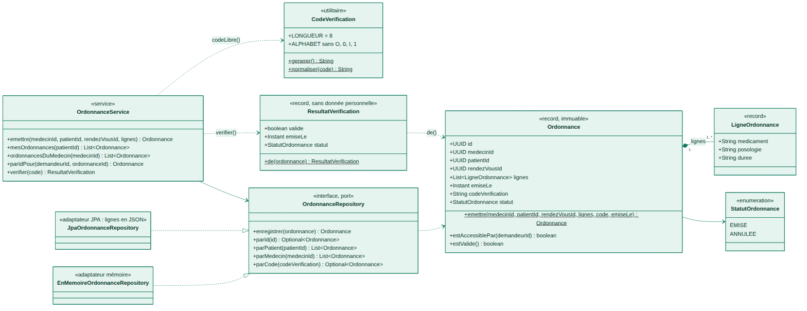

### Téléconsultation

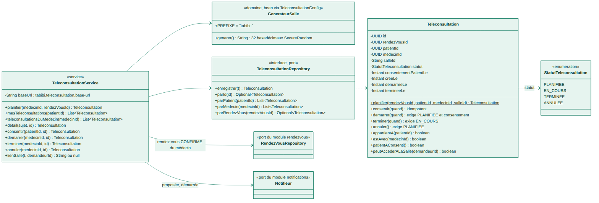

Cycle de vie : `PLANIFIEE` (par le médecin, sur un rendez-vous confirmé, une seule session non annulée par
rendez-vous), `EN_COURS` (démarrage par le médecin, **impossible sans consentement du patient**), `TERMINEE`, ou
`ANNULEE` depuis `PLANIFIEE`. Le lien de salle n'est remis au patient qu'après son consentement.

### Messagerie

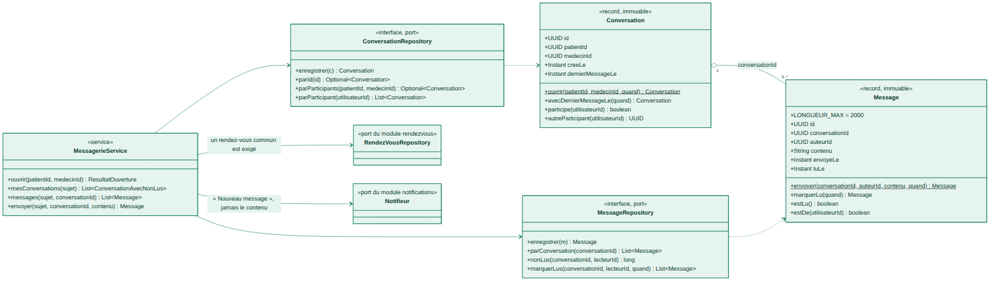

### Avis

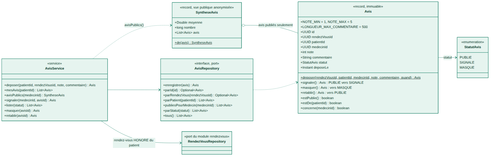

Cycle de vie : `PUBLIE` au dépôt, `SIGNALE` par le médecin concerné, `MASQUE` ou de nouveau `PUBLIE` par
l'administrateur. Seuls les avis publiés entrent dans la synthèse publique, qui ne porte ni `patientId` ni
`rendezVousId`.

### Dawini (besoins de médicaments)

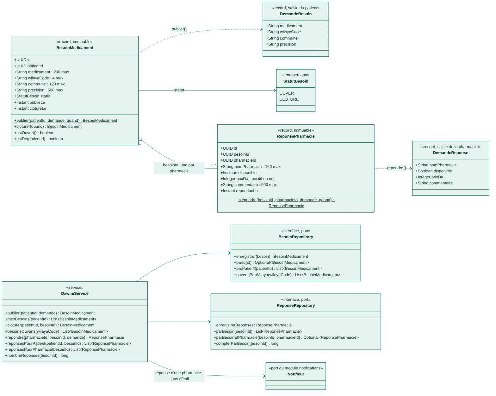

### Administration et cabinet

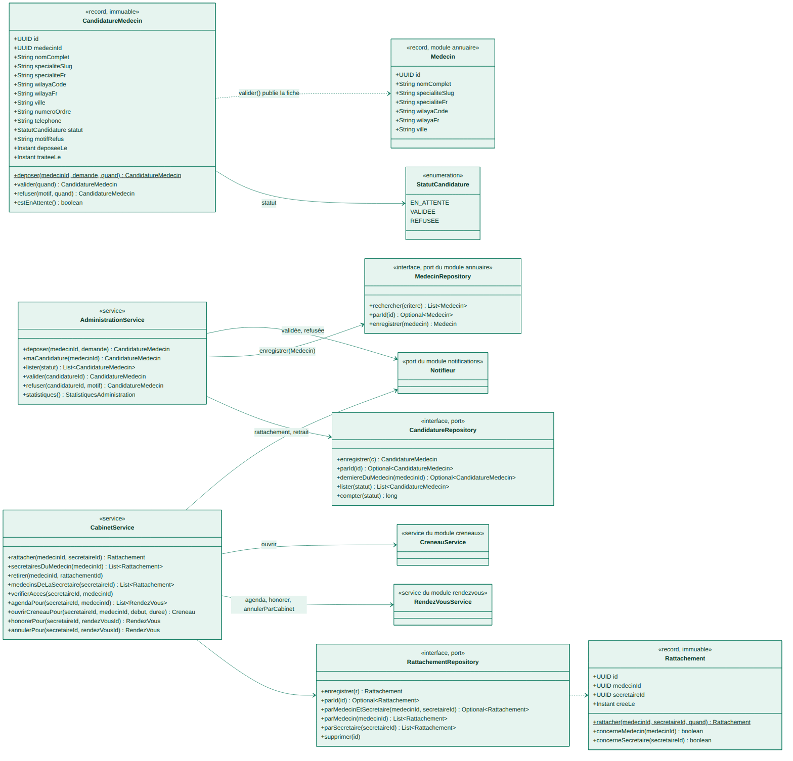

### Profil et liste d'attente

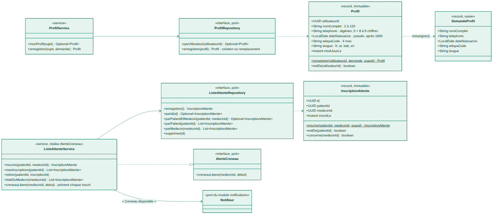

### Notifications, audit et rappels

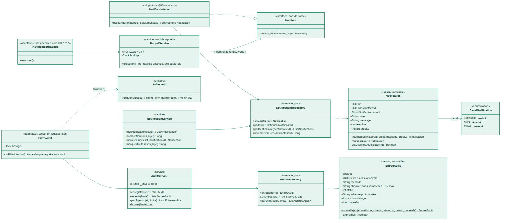

## 6. Modèle de données

Le schéma est versionné par Liquibase (`src/main/resources/db/changelog`, changelogs `001` à `016`, un par
fonctionnalité) et appliqué au démarrage de l'API sous le profil `postgres`. Toutes les clés sont des `uuid` ; les
dates sont des `timestamptz` (UTC en base, présentées à l'heure d'Algérie dans les messages). Il n'y a **aucune
clé étrangère physique** : les liens du diagramme sont logiques, les identifiants de patients, secrétaires et
pharmacies sont des sujets Keycloak qui n'ont pas de table applicative.

### Noyau : annuaire, agenda, actes de soin

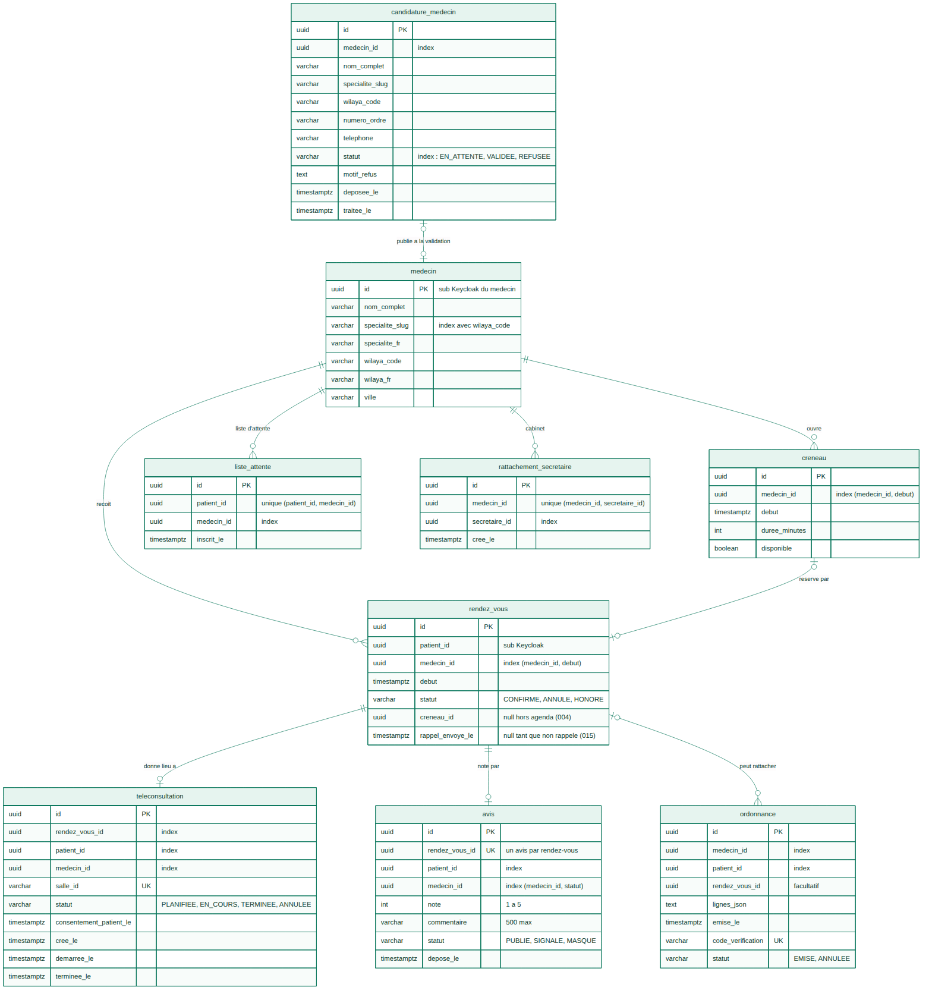

### Échanges : notifications, messagerie, Dawini

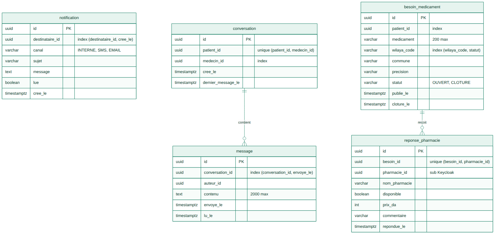

### Comptes et audit

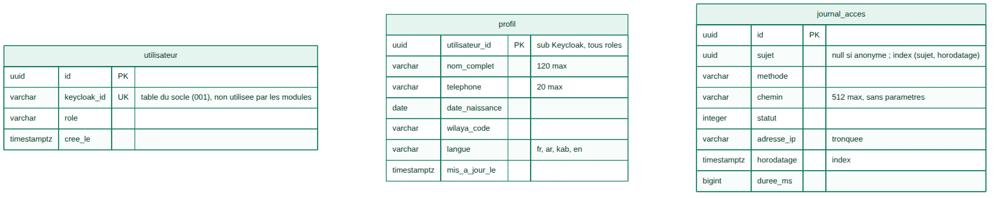

| Changelog | Tables et colonnes | Fonctionnalité |
|---|---|---|
| 001 | `utilisateur`, `rendez_vous` (+ index `medecin_id, debut`) | Socle |
| 002 | `medecin` (+ index `specialite_slug, wilaya_code`) | Annuaire |
| 003 | `creneau` (+ index `medecin_id, debut`) | Créneaux |
| 004 | `rendez_vous.creneau_id` | Réservation d'un créneau |
| 005 | `ordonnance` (`code_verification` unique, index patient et médecin) | Ordonnances |
| 006 | `teleconsultation` (`salle_id` unique, index patient, médecin, rendez-vous) | Téléconsultation |
| 007 | `notification` (index `destinataire_id, cree_le`) | Notifications |
| 008 | `candidature_medecin` (index médecin, statut) | Administration |
| 009 | `conversation` (unique `patient_id, medecin_id`), `message` (index `conversation_id, envoye_le`) | Messagerie |
| 010 | `avis` (`rendez_vous_id` unique, index `medecin_id, statut`, patient) | Avis |
| 011 | `besoin_medicament` (index patient, `wilaya_code, statut`), `reponse_pharmacie` (unique `besoin_id, pharmacie_id`) | Dawini |
| 012 | `profil` (clé `utilisateur_id`) | Profil |
| 013 | `liste_attente` (unique `patient_id, medecin_id`, index médecin) | Liste d'attente |
| 014 | `rattachement_secretaire` (unique `medecin_id, secretaire_id`, index secrétaire) | Cabinet |
| 015 | `rendez_vous.rappel_envoye_le` | Rappels |
| 016 | `journal_acces` (index `horodatage`, `sujet, horodatage`) | Journal des accès |

## 7. Sécurité

Le détail (modèle de menace, durcissement, reste à faire) est dans [SECURITE.md](SECURITE.md). L'essentiel :

- **Identité déléguée à Keycloak 26** (realm `tabibi`, `infra/keycloak/tabibi-realm.json` de ce dépôt) : deux
  clients publics `tabibi-web` et `tabibi-mobile` en Authorization Code + PKCE S256, aucun secret côté client,
  redirections explicites (jamais `*`), jeton d'accès de 5 minutes, session inactive close après 30 minutes,
  protection contre la force brute, politique de mot de passe, OTP TOTP disponible.
- **API sans état** : chaque requête porte un JWT ; `SecurityConfig` valide la signature via le JWKS du realm
  (`issuer-uri`), traduit `realm_access.roles` en autorités `ROLE_*` (`KeycloakRoleConverter`), ouvre sans jeton
  seulement l'annuaire (`GET /api/medecins/**`), la vérification d'ordonnance, la santé (`/actuator/health/**`) et
  Swagger, verrouille `/api/admin/**` au rôle ADMIN par chemin, puis chaque endpoint porte son `@PreAuthorize`.
- **Trois niveaux d'autorisation** : chemin (SecurityConfig), rôle (`@PreAuthorize`), **propriétaire** dans le cas
  d'usage (`rdv.appartientA(patientId)`, `teleconsultation.estAvec(medecinId)`, rattachement secrétaire-médecin
  vérifié à chaque action) : 403 `AccesRefuseException` sinon.
- **CORS** restreint aux origines de `TABIBI_CORS_ORIGINES`, sur `/api/**`, sans cookies.
- **Consentement explicite** du patient avant tout accès au lien d'une téléconsultation.
- **Anonymisation** : la synthèse publique des avis ne porte aucun identifiant ; les besoins Dawini vus par les
  pharmacies ne portent pas `patientId` ; la vérification publique d'une ordonnance ne renvoie que
  `{ valide, emiseLe, statut }`.
- **Aucune donnée de santé dans les notifications ni dans les journaux** : « Vous avez reçu un nouveau message »
  sans le contenu, « Une pharmacie a répondu » sans détail ; le journal des accès n'enregistre ni corps ni paramètres
  et tronque l'adresse IP.
- **Journal des accès** (`FiltreAudit`) : qui, quoi, quand, statut, durée ; consultable par l'administrateur.

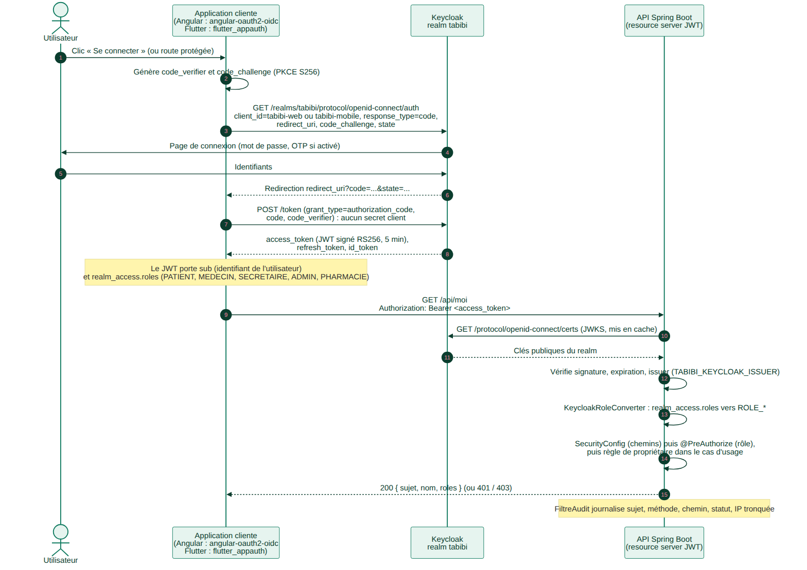

## 8. API : tous les endpoints par rôle

Tiré des contrôleurs (`@GetMapping` / `@PostMapping` / `@PutMapping` et `@PreAuthorize`) et de `SecurityConfig`.
Documentation interactive : `/swagger-ui.html`. Les erreurs métier ont toujours le corps `{ "erreur": "..." }`.

### Sans jeton (public)

| Méthode | Chemin | Description |
|---|---|---|
| GET | `/api/medecins?specialite=&wilaya=&q=` | recherche de praticiens |
| GET | `/api/medecins/{id}` | fiche d'un praticien (404 si inconnu) |
| GET | `/api/medecins/{id}/creneaux` | créneaux encore disponibles |
| GET | `/api/medecins/{id}/avis` | avis publiés, anonymisés : `{ moyenne, nombre, avis: [{ id, note, commentaire, deposeLe }] }` |
| GET | `/api/ordonnances/verifier/{code}` | vérification d'une ordonnance par un pharmacien : `{ valide, emiseLe, statut }` |
| GET | `/actuator/health`, `/actuator/health/liveness`, `/actuator/health/readiness` | santé et sondes |
| GET | `/swagger-ui.html`, `/v3/api-docs/**` | documentation d'API |

### Tout utilisateur authentifié (`isAuthenticated()`)

| Méthode | Chemin | Description |
|---|---|---|
| GET | `/api/moi` | `{ sujet, nom, roles }` portés par le jeton |
| GET | `/api/moi/profil` | mon profil (404 tant qu'il n'est pas renseigné) |
| PUT | `/api/moi/profil` | renseigne ou remplace `{ nomComplet, telephone, dateNaissance, wilayaCode, langue }` (400 si invalide) |
| GET | `/api/notifications/mes` | mes notifications, les plus récentes d'abord |
| GET | `/api/notifications/non-lues/nombre` | `{ "nombre": n }` |
| POST | `/api/notifications/{id}/lue` | marque lue (403 si elle n'est pas à moi, 404) |
| POST | `/api/notifications/toutes-lues` | `{ "nombre": n }` passées à lues |

### Rôle PATIENT

| Méthode | Chemin | Description |
|---|---|---|
| POST | `/api/rendezvous` | réserve un horaire libre `{ medecinId, debut }` (201, 409 si pris) |
| POST | `/api/creneaux/{id}/reserver` | réserve un créneau de l'agenda (201, 404, 409) |
| GET | `/api/rendezvous/mes` | mes rendez-vous, du plus proche au plus lointain |
| POST | `/api/rendezvous/{id}/annuler` | annule (idempotent) ; créneau remis à disposition, médecin prévenu |
| GET | `/api/ordonnances/mes` | mes ordonnances, les plus récentes d'abord |
| GET | `/api/teleconsultations/mes` | mes téléconsultations (`lienSalle` null sans consentement) |
| POST | `/api/teleconsultations/{id}/consentir` | consentement explicite (idempotent, 409 si terminée ou annulée) |
| POST | `/api/conversations` | ouvre une conversation `{ medecinId }` avec un médecin déjà consulté (201 ou 200, 403 sans rendez-vous commun) |
| POST | `/api/avis` | dépose `{ rendezVousId, note, commentaire }` sur un rendez-vous honoré (201, 400, 403, 404, 409) |
| GET | `/api/avis/mes` | mes avis, tous statuts |
| POST | `/api/dawini/besoins` | publie un besoin `{ medicament, wilayaCode, commune, precision }` (201, 400) |
| GET | `/api/dawini/besoins/mes` | mes besoins avec `nombreReponses` |
| POST | `/api/dawini/besoins/{id}/cloturer` | clôture (404, 403, 409) |
| POST | `/api/medecins/{id}/liste-attente` | inscription sur la liste d'attente d'un médecin (201, 409) |
| GET | `/api/liste-attente/mes` | mes inscriptions |
| POST | `/api/liste-attente/{id}/retirer` | retrait (204, 404, 403) |

### Rôle MEDECIN

| Méthode | Chemin | Description |
|---|---|---|
| GET | `/api/medecin/rendezvous` | mon agenda, tous statuts |
| POST | `/api/rendezvous/{id}/honorer` | le patient est venu (403 autre médecin, 409 si non confirmé) |
| POST | `/api/medecin/rendezvous/{id}/annuler` | annulation par le cabinet : créneau libéré, patient prévenu (403, 409, 404) |
| POST | `/api/medecin/creneaux` | ouvre un créneau `{ debut, dureeMinutes }` (201, 400 : futur, 5 à 120 min) |
| POST | `/api/ordonnances` | rédige une ordonnance `{ patientId, rendezVousId, lignes[] }` (201, 400) |
| GET | `/api/medecin/ordonnances` | ordonnances que j'ai rédigées |
| POST | `/api/medecin/teleconsultations` | planifie `{ rendezVousId }` sur un rendez-vous confirmé (201, 404, 403, 409) |
| GET | `/api/medecin/teleconsultations` | mes téléconsultations |
| POST | `/api/teleconsultations/{id}/demarrer` | ouvre la session (409 sans consentement) |
| POST | `/api/teleconsultations/{id}/terminer` | clôt (409 si pas en cours) |
| POST | `/api/teleconsultations/{id}/annuler` | annule une session planifiée (409 sinon) |
| POST | `/api/medecin/candidature` | dépose ma candidature à l'annuaire (201, 400, 409) |
| GET | `/api/medecin/candidature` | ma dernière candidature (404 si aucune) |
| POST | `/api/avis/{id}/signaler` | signale un avis publié qui me concerne (403, 409) |
| GET | `/api/medecin/liste-attente` | ma liste d'attente, les plus anciens inscrits d'abord |
| POST | `/api/medecin/secretaires` | rattache une secrétaire `{ secretaireId }` (201, 400, 409) ; elle est prévenue |
| GET | `/api/medecin/secretaires` | mes rattachements `[{ id, medecinId, secretaireId, creeLe }]` |
| POST | `/api/medecin/secretaires/{id}/retirer` | retrait (204, 404, 403) |

### Rôle SECRETAIRE (rattachée au cabinet par le médecin, 403 sinon)

| Méthode | Chemin | Description |
|---|---|---|
| GET | `/api/secretaire/medecins` | cabinets auxquels je suis rattachée |
| GET | `/api/secretaire/medecins/{medecinId}/rendezvous` | agenda du médecin |
| POST | `/api/secretaire/medecins/{medecinId}/creneaux` | ouvre un créneau dans son agenda (201, 400) |
| POST | `/api/secretaire/rendezvous/{id}/honorer` | le patient est venu (404, 409) |
| POST | `/api/secretaire/rendezvous/{id}/annuler` | annule pour le cabinet : créneau libéré, patient prévenu (404, 409) |

### Rôle PHARMACIE (Dawini)

| Méthode | Chemin | Description |
|---|---|---|
| GET | `/api/dawini/besoins?wilaya=16` | besoins ouverts de la wilaya, sans `patientId` (400 sans wilaya) |
| POST | `/api/dawini/besoins/{id}/reponses` | répond `{ nomPharmacie, disponible, prixDa, commentaire }` (201, 400, 404, 409) ; le patient est prévenu |

### PATIENT (propriétaire) ou PHARMACIE

| Méthode | Chemin | Description |
|---|---|---|
| GET | `/api/dawini/besoins/{id}/reponses` | réponses à un besoin, les plus anciennes d'abord (404, 403) |

### PATIENT ou MEDECIN (règle de propriétaire, 403 sinon)

| Méthode | Chemin | Description |
|---|---|---|
| GET | `/api/ordonnances/{id}` | une ordonnance, pour son patient ou son médecin auteur |
| GET | `/api/teleconsultations/{id}` | une téléconsultation, pour son patient ou son médecin |
| GET | `/api/conversations` | mes conversations, la plus récente activité d'abord, avec `nonLus` |
| GET | `/api/conversations/{id}/messages` | messages du plus ancien au plus récent ; les messages reçus sont marqués lus |
| POST | `/api/conversations/{id}/messages` | envoie `{ contenu }` (201, 400 si vide ou > 2000 caractères) ; l'autre participant est prévenu |

### Rôle ADMIN (`/api/admin/**` aussi verrouillé par chemin)

| Méthode | Chemin | Description |
|---|---|---|
| GET | `/api/admin/candidatures?statut=EN_ATTENTE` | candidatures, statut optionnel |
| POST | `/api/admin/candidatures/{id}/valider` | publie le médecin dans l'annuaire et le prévient (404, 409) |
| POST | `/api/admin/candidatures/{id}/refuser` | refuse avec `{ motif }` (400, 404, 409) |
| GET | `/api/admin/statistiques` | `{ candidaturesEnAttente, candidaturesValidees, candidaturesRefusees }` |
| GET | `/api/admin/avis?statut=SIGNALE` | avis avec `patientId` et `rendezVousId` |
| POST | `/api/admin/avis/{id}/masquer` | retire un avis de la vue publique (409 si déjà masqué) |
| POST | `/api/admin/avis/{id}/retablir` | remet en ligne (409 si déjà publié) |
| POST | `/api/admin/rappels/executer` | rappels des 24 prochaines heures, tout de suite : `{ "nombre": n }` |
| GET | `/api/admin/audit?limite=100` | journal des accès, les plus récents d'abord (`limite` 1 à 1000) |
| GET | `/api/admin/audit/sujet/{id}?limite=100` | accès d'un utilisateur |

## 9. Front web (Angular)

**Structure** (`src/app`, un dossier par domaine, composants standalone, signaux) :

```
app.config.ts        provideRouter, provideOAuthClient, provideHttpClient(withInterceptors([authInterceptor]), withFetch()),
                     provideClientHydration(), APP_INITIALIZER qui charge assets/config.json, LOCALE_ID = fr
app.config.server.ts provideServerRendering() + CONFIGURATION_SERVEUR lue dans process.env (rendu côté serveur)
main.server.ts, server.ts (racine)   point d'entrée serveur et serveur express : fichiers statiques, rendu Angular
                     avec secours sans rendu (TABIBI_SSR_DELAI_MS), en-têtes de sécurité et CSP
app.routes.ts        routes (voir ci-dessous)
auth/                auth.config.ts (creerAuthConfig : issuer, client, PKCE code flow), auth.service.ts (initialisation
                     OIDC unique, seConnecter(retour), seDeconnecter), auth.interceptor.ts (Bearer sur /api/),
                     role.service.ts (roles lus une fois sur /api/moi : estMedecin, estAdmin, estPharmacie, estSecretaire),
                     medecin.guard.ts, admin.guard.ts, pharmacie.guard.ts, secretaire.guard.ts
config/              config.service.ts (apiUrl, keycloakIssuer, keycloakClientId lus a l'execution)
annuaire/ fiche-medecin/ rendezvous/ ordonnances/ notifications/ teleconsultation/ messagerie/ avis/ dawini/
liste-attente/ moi/ medecin/ secretaire/ pharmacie/ admin/    un service HTTP + des composants par domaine
```

**Configuration à l'exécution.** Le build est identique partout : dans le navigateur, `ConfigService` lit
`assets/config.json` (`apiUrl`, `keycloakIssuer`, `keycloakClientId`) avant le démarrage ; côté serveur, le jeton
`CONFIGURATION_SERVEUR` est lu dans `process.env`. En production, `docker/entrypoint.sh` de l'image
(`node:20-alpine`, `server.mjs` sur le port 80, utilisateur `node`) écrit ce fichier à partir de `TABIBI_API_URL`,
`TABIBI_KEYCLOAK_ISSUER`, `TABIBI_KEYCLOAK_CLIENT_ID` (ou les dérive de `DOMAINE`) et exporte les mêmes variables
pour le serveur, qui calcule la CSP avec ces origines.

**Rendu côté serveur (SSR, v0.19.0).** Les pages publiques (annuaire, fiche du praticien, vérification) arrivent en
HTML complet, lisibles par les moteurs de recherche ; `provideClientHydration()` réutilise le DOM rendu et transmet
les réponses `GET` du rendu au navigateur (cache de transfert). Hors navigateur, `AuthService` ne configure pas
l'OIDC (jamais connecté), la cloche ne lance pas sa minuterie, `prerender` est désactivé (un prérendu à la
construction figerait un annuaire vide).

**Routes.**

| Route | Composant | Accès |
|---|---|---|
| `/` | `AnnuaireComponent` | public |
| `/medecins/:id` | `FicheMedecinComponent` (créneaux, réservation, avis, liste d'attente, « Écrire au médecin ») | public, actions PATIENT |
| `/verifier` | `VerifierOrdonnanceComponent` | public |
| `/mes-rendez-vous`, `/mes-ordonnances`, `/ordonnances/:id`, `/teleconsultations`, `/mes-avis`, `/avis/nouveau/:rendezVousId`, `/dawini`, `/dawini/:id`, `/liste-attente` | espace patient | connecté (redirection Keycloak sinon) |
| `/notifications`, `/messagerie`, `/messagerie/:id`, `/moi`, `/moi/profil` | tous rôles | connecté |
| `/medecin/agenda`, `/medecin/disponibilites`, `/medecin/ordonnances`, `/medecin/ordonnance/nouvelle`, `/medecin/teleconsultations`, `/medecin/candidature`, `/medecin/avis`, `/medecin/liste-attente`, `/medecin/secretaires` | espace médecin | `medecinGuard` |
| `/secretaire` | `EspaceSecretaireComponent` | `secretaireGuard` |
| `/pharmacie` | `EspacePharmacieComponent` | `pharmacieGuard` |
| `/admin`, `/admin/candidatures`, `/admin/avis` | administration | `adminGuard` |

**Gardes.** Toutes sur le même modèle : non connecté, connexion Keycloak avec retour sur la page demandée ; connecté
sans le rôle, retour à l'accueil (`router.parseUrl('/')`). Ce sont des conforts d'interface : l'autorisation réelle
reste côté API.

**Tests.** Karma / Jasmine, 271 specs (`ng test --watch=false --browsers=ChromeHeadlessCI`), services avec
`HttpTestingController`, composants avec services factices.

## 10. Application mobile (Flutter)

**Périmètre.** Application **patient** (Android et iOS, un seul code) : recherche, fiche et créneaux, réservation et
annulation, ordonnances (liste, détail, vérification publique), notifications, téléconsultations (consentement, lien
de salle ouvert dans le navigateur externe), messagerie, avis, Dawini, listes d'attente, profil.

**Structure** (`lib/`) :

```
main.dart              TabibiApp (Material 3, couleur #0F7560) et RecherchePage (accueil : recherche, entrées de l'espace
                       personnel, compteur de notifications non lues)
config/configuration.dart   TABIBI_API_URL, TABIBI_ISSUER, TABIBI_CLIENT_ID, TABIBI_REDIRECT (--dart-define ;
                       défauts de l'émulateur Android : 10.0.2.2)
services/api_service.dart   tous les appels HTTP (ApiException(statusCode, message)) ; auth_service.dart (flutter_appauth,
                       PKCE, sujet du jeton) ; session.dart (instance partagée)
models/                avis, besoin_medicament, conversation, inscription_attente, message, notification, profil,
                       reponse_pharmacie, synthese_avis, teleconsultation (fromJson tolérants)
pages/                 fiche_medecin, mes_rendez_vous, mes_ordonnances, detail_ordonnance, verifier_ordonnance,
                       mes_notifications, mes_teleconsultations, mes_conversations, conversation, deposer_avis,
                       mes_avis, dawini, reponses_besoin, mes_listes_attente, mon_profil
utils/                 dates (heure locale, sans intl), libelles, identifiants (UUID en texte, abréviation), ...
widgets/               vue_connexion (invitation « Se connecter »), vue_erreur
```

**Configuration.** Aucune adresse codée en dur : quatre variables fixées à la compilation (`--dart-define`), client
Keycloak public `tabibi-mobile` (PKCE, aucun secret), redirection `dz.tabibi.app:/oauthredirect` à déclarer dans les
projets natifs (`tool/preparer_android.sh` le fait pour Android). Les projets `android/` et `ios/` ne sont pas
versionnés (générés par `flutter create .`).

**Tests.** `flutter test` (modèles, utilitaires, pages avec `FakeApiService`) ; CI GitHub Actions : `flutter analyze`,
`flutter test`, APK de débogage en artefact.

**Limites connues** (voir le README du dépôt) : le jeton est gardé en mémoire (pas encore de stockage sécurisé ni de
rafraîchissement), pas de notifications push, pas d'icône ni d'écran de lancement fournis.

## 11. Parcours clés (séquences)

### Réserver puis annuler un rendez-vous

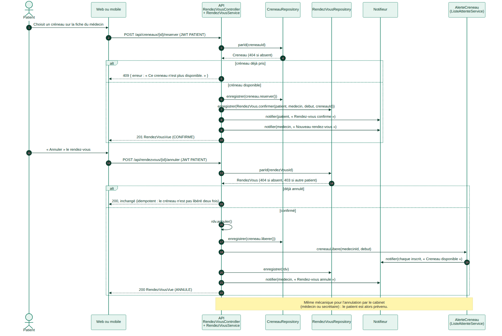

### Téléconsultation avec consentement

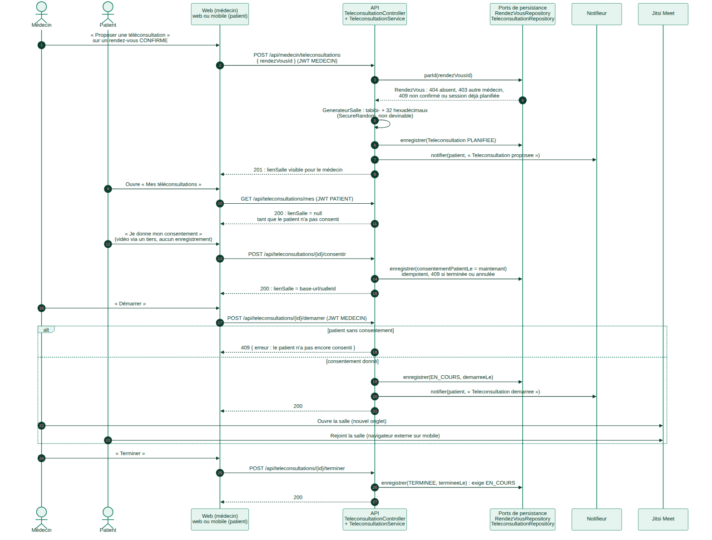

### Dawini : demander un médicament aux pharmacies

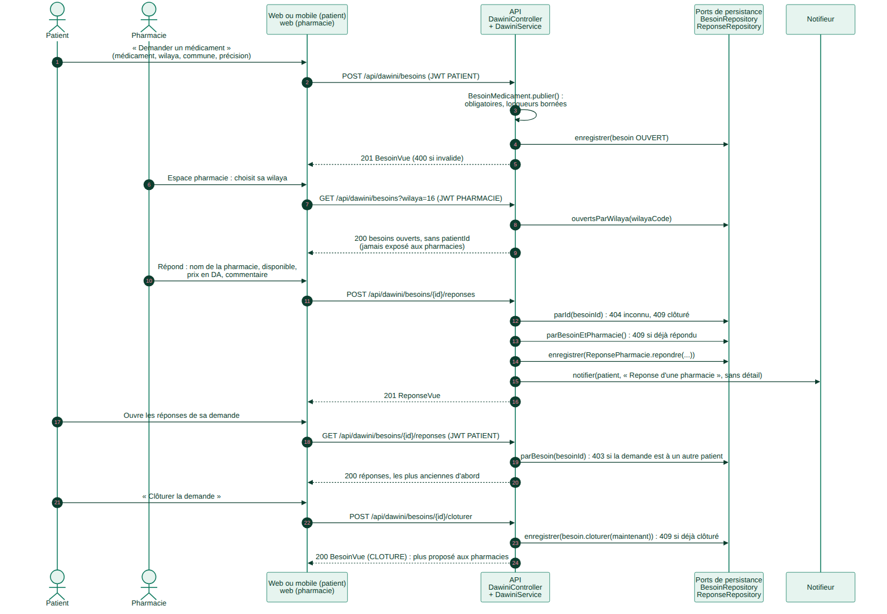

### Rappels de rendez-vous

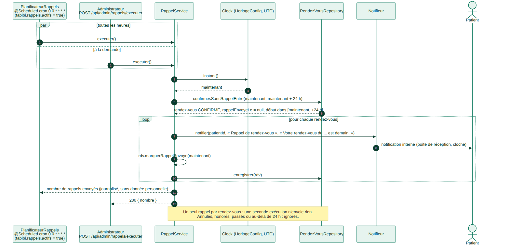

## 12. Conventions

- **Nommage en français** dans le code (classes, méthodes, tables, routes, messages), sans accents dans les
  identifiants (`RendezVous`, `creneau`, `honorer`), avec accents dans les textes affichés et la documentation.
- **Un commit par fonctionnalité**, message conventionnel `type(scope): description` (`feat`, `fix`, `docs`, `test`,
  `refactor`, `chore`, `build`, `ci`), corps qui explique le pourquoi et liste les vérifications, trailers
  `Co-Authored-By` et `Claude-Session` quand le commit est produit avec l'assistant (voir
  [GUIDE-DEVELOPPEUR.md](GUIDE-DEVELOPPEUR.md)).
- **Chaque fonctionnalité arrive avec ses tests**, son entrée dans le README du dépôt et dans `docs/JOURNAL.md`
  (version `vX.Y.0`, correctif `vX.Y.1`).
- **Erreurs** : jamais de 500 pour une règle métier ; `{ "erreur": "..." }` et le bon code (400, 403, 404, 409).
- **Dates** : `Instant` UTC dans le domaine et la base ; `FormatDate.lisible` (Africa/Algiers) dans les messages ;
  `LOCALE_ID = fr` côté web.
- **Identifiants** : UUID partout, sérialisés en texte ; le sujet du jeton est l'identifiant de l'utilisateur.
- **Aucune donnée personnelle** dans les réponses publiques, les notifications, les journaux, les messages de commit.
