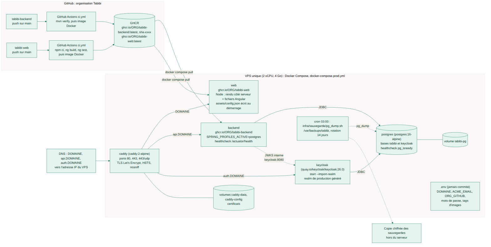
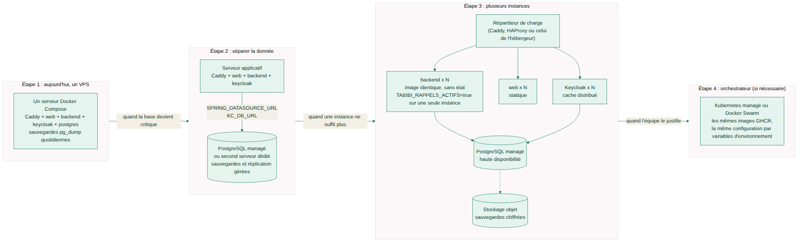

# Déployer Tabibi sur un serveur

> **Pourquoi ce document.** C'est le guide pas à pas pour mettre la plateforme en ligne sur un VPS unique avec
> Docker Compose, la vérifier, la sauvegarder, la mettre à jour, et savoir comment elle grandira. Les fichiers
> d'infrastructure vivent dans le dépôt `tabibi-backend` (`docker-compose.prod.yml`, `infra/`, `.env.example`) ; ce
> dépôt-ci porte l'environnement de développement (`docker-compose.yml`) et la copie du realm Keycloak.

## Sommaire

1. [Vue d'ensemble](#1-vue-densemble)
2. [Prérequis](#2-prérequis)
3. [DNS : trois sous-domaines](#3-dns--trois-sous-domaines)
4. [Préparer le serveur](#4-préparer-le-serveur)
5. [Configurer : `.env`](#5-configurer--env)
6. [Générer le realm Keycloak de production](#6-générer-le-realm-keycloak-de-production)
7. [Démarrer](#7-démarrer)
8. [Vérifier](#8-vérifier)
9. [Premiers comptes](#9-premiers-comptes)
10. [Sauvegardes et restauration](#10-sauvegardes-et-restauration)
11. [Mettre à jour](#11-mettre-à-jour)
12. [Journalisation et supervision](#12-journalisation-et-supervision)
13. [Application mobile](#13-application-mobile)
14. [Évolution : grandir sans réécrire](#14-évolution--grandir-sans-réécrire)
15. [Points de vigilance connus](#15-points-de-vigilance-connus)

## 1. Vue d'ensemble



| Service | Image | Rôle |
|---|---|---|
| `caddy` | `caddy:2-alpine` | reverse proxy, certificats Let's Encrypt automatiques, seuls ports exposés (80, 443, 443/udp) ; `DOMAINE` vers `web:80`, `api.DOMAINE` vers `backend:8080`, `auth.DOMAINE` vers `keycloak:8080` ; HSTS, `nosniff`, `Referrer-Policy`, en-tête `Server` retiré |
| `web` | `ghcr.io/ORG_GITHUB/tabibi-web:WEB_TAG` | serveur Node (express + rendu Angular côté serveur, port 80, utilisateur `node`) qui sert le build et écrit `assets/config.json` au démarrage ; `TABIBI_SSR_DELAI_MS` (10 s) : au-delà, page sans rendu (voir vigilance n° 1) |
| `backend` | `ghcr.io/ORG_GITHUB/tabibi-backend:BACKEND_TAG` | API Spring Boot, profil `postgres`, migrations Liquibase au démarrage, `HEALTHCHECK` sur `/actuator/health` |
| `keycloak` | `quay.io/keycloak/keycloak:26.0` | `start --import-realm`, base dédiée `keycloak`, derrière le proxy (`KC_PROXY_HEADERS=xforwarded`) |
| `postgres` | `postgres:16-alpine` | bases `tabibi` et `keycloak` (rôle dédié créé au premier démarrage par `infra/postgres/init/01-keycloak.sh`), volume `tabibi-pg`, `healthcheck pg_isready` |

Volumes nommés : `tabibi-pg` (données), `caddy-data` et `caddy-config` (certificats). Réseau interne `interne`.

## 2. Prérequis

- Un **nom de domaine** (par exemple `tabibi.dz` ou `tabibi.com`) dont vous contrôlez les enregistrements DNS.
- Un **VPS** avec au moins **2 vCPU et 4 Go de mémoire** (Keycloak et l'API sont des JVM), 40 Go de disque, une
  adresse IP publique, Ubuntu LTS ou Debian récent. Ordres de prix dans [CHOIX-TECHNIQUES.md](CHOIX-TECHNIQUES.md).
- **Docker Engine et Docker Compose v2** sur le serveur.
- Un accès aux images sur **GHCR** : la CI de `tabibi-backend` et de `tabibi-web` publie `latest` et `sha-<commit>`
  à chaque push sur la branche `main`. Si les paquets sont privés, un jeton GitHub `read:packages` pour
  `docker login ghcr.io` sur le serveur.
- Une adresse e-mail pour Let's Encrypt (avis d'expiration).

## 3. DNS : trois sous-domaines

Créer trois enregistrements **A** (et AAAA si le serveur a une IPv6) vers l'adresse IP du VPS :

| Nom | Sert |
|---|---|
| `DOMAINE` (par exemple `tabibi.dz`) | le front web |
| `api.DOMAINE` | l'API |
| `auth.DOMAINE` | Keycloak |

Attendre la propagation (`dig +short api.DOMAINE`) **avant** le premier démarrage : Caddy obtient les certificats
dès qu'il démarre et échoue si les noms ne pointent pas encore vers lui.

## 4. Préparer le serveur

```bash
# En root ou avec sudo, sur Ubuntu / Debian
apt update && apt upgrade -y
curl -fsSL https://get.docker.com | sh          # Docker Engine + plugin compose
docker compose version

# Pare-feu : SSH, HTTP, HTTPS seulement
ufw allow OpenSSH && ufw allow 80/tcp && ufw allow 443/tcp && ufw allow 443/udp && ufw enable

# Le dépôt backend porte l'orchestration
mkdir -p /opt/tabibi && cd /opt/tabibi
git clone https://github.com/<org>/tabibi-backend.git
cd tabibi-backend
```

Recommandé : accès SSH par clé seulement, `fail2ban`, mises à jour de sécurité automatiques (voir
[SECURITE.md](SECURITE.md)).

## 5. Configurer : `.env`

```bash
cp .env.example .env
chmod 600 .env
openssl rand -base64 32     # à répéter pour chaque secret
```

| Variable | Valeur |
|---|---|
| `DOMAINE` | votre domaine (`tabibi.dz`) ; le front est sur `https://DOMAINE`, l'API sur `https://api.DOMAINE`, Keycloak sur `https://auth.DOMAINE` |
| `ACME_EMAIL` | adresse transmise à Let's Encrypt |
| `ORG_GITHUB` | organisation (ou compte) GitHub propriétaire des images `ghcr.io/ORG_GITHUB/tabibi-backend` et `tabibi-web` (en minuscules) |
| `BACKEND_TAG`, `WEB_TAG` | `latest` pour commencer ; `sha-xxxxxxx` pour figer une version (recommandé en production) |
| `POSTGRES_PASSWORD` | mot de passe de la base `tabibi` (utilisé aussi par l'API) |
| `KEYCLOAK_DB_PASSWORD` | mot de passe du rôle PostgreSQL `keycloak` |
| `KEYCLOAK_ADMIN_USERNAME`, `KEYCLOAK_ADMIN_PASSWORD` | administrateur **temporaire** de démarrage de Keycloak |
| `TABIBI_TELECONSULTATION_BASE_URL` | `https://meet.jit.si` par défaut ; l'URL de votre instance Jitsi de préférence |

Les secrets : longs, aléatoires, sans apostrophe ni espace. Le fichier `.env` n'est jamais commité.

## 6. Générer le realm Keycloak de production

```bash
infra/keycloak/realm-production.py          # lit DOMAINE dans .env (ou : realm-production.py tabibi.dz)
# Realm de production ecrit : infra/keycloak/production/tabibi-realm.json
#   comptes de demonstration retires : patient.demo, medecin.demo, admin.demo, pharmacie.demo, secretaire.demo
#   direct access grants desactives sur : tabibi-web, tabibi-mobile
#   domaine : tabibi.dz
```

Ce fichier (ignoré par git) est monté dans Keycloak et importé **au premier démarrage seulement**. Les cinq comptes de
démonstration ne doivent jamais exister en production.

## 7. Démarrer

```bash
docker login ghcr.io                          # seulement si les paquets GHCR sont privés
docker compose -f docker-compose.prod.yml pull
docker compose -f docker-compose.prod.yml up -d
docker compose -f docker-compose.prod.yml ps  # backend « healthy » après une minute environ
```

Ordre de démarrage géré par Compose : `postgres` (sain) puis `keycloak` et `backend`, puis `caddy`.

## 8. Vérifier

```bash
curl -s https://api.DOMAINE/actuator/health              # {"status":"UP"}
curl -s https://api.DOMAINE/actuator/health/readiness    # sonde de disponibilité
curl -s https://auth.DOMAINE/realms/tabibi | head -c 200 # le realm est importé
curl -sI https://DOMAINE/ | grep -i strict-transport      # HSTS posé par Caddy
curl -s https://DOMAINE/assets/config.json               # apiUrl et keycloakIssuer doivent viser api. et auth.DOMAINE
curl -s "https://api.DOMAINE/api/medecins" | head -c 200 # annuaire public (vide au départ)
docker compose -f docker-compose.prod.yml logs -f backend
```

Dans un navigateur : `https://DOMAINE` affiche l'annuaire ; « Se connecter » redirige vers `https://auth.DOMAINE`
(page de connexion Keycloak) ; `https://auth.DOMAINE/admin/` ouvre la console d'administration.

## 9. Premiers comptes

1. Console Keycloak (`https://auth.DOMAINE/admin/`) avec l'administrateur temporaire : créer un **administrateur
   permanent** (realm `master`), lui activer la MFA, puis supprimer le compte temporaire.
2. Realm `tabibi` : créer les utilisateurs et leur attribuer un rôle du realm (`PATIENT`, `MEDECIN`, `SECRETAIRE`,
   `PHARMACIE`, `ADMIN`). Un médecin apparaît dans l'annuaire seulement après **candidature** (depuis son espace
   web) et **validation** par un compte `ADMIN` (`/admin/candidatures`).
3. Imposer la MFA aux rôles `ADMIN` et `MEDECIN` (procédure dans [SECURITE.md](SECURITE.md)).
4. Pour laisser les patients s'inscrire eux-mêmes : *Realm settings > Login > User registration*, puis attribuer
   `PATIENT` comme rôle par défaut (*Realm roles > default-roles-tabibi*). Ce réglage n'est pas dans le realm
   versionné : le reporter dans `tabibi-realm.json` si on le retient.

## 10. Sauvegardes et restauration

`infra/sauvegarde/pg_dump.sh` sauvegarde les bases `tabibi` (données de patients) et `keycloak` (identités et clés
de signature) au format custom compressé, un fichier horodaté par base dans `/var/backups/tabibi` (`chmod 700`),
et supprime les fichiers de plus de 14 jours (`RETENTION_JOURS`).

```bash
# Cron, tous les jours à 3 h
0 3 * * * /opt/tabibi/tabibi-backend/infra/sauvegarde/pg_dump.sh >> /var/log/tabibi-sauvegarde.log 2>&1
```

Restauration d'une base (ici `tabibi`) :

```bash
docker compose -f docker-compose.prod.yml stop backend
docker compose -f docker-compose.prod.yml exec -T postgres \
  pg_restore -U tabibi -d tabibi --clean --if-exists < /var/backups/tabibi/tabibi-<horodatage>.dump
docker compose -f docker-compose.prod.yml start backend
```

Même chose avec `-d keycloak` et le dump `keycloak-<horodatage>.dump` (arrêter `keycloak` pendant l'opération).
Les sauvegardes contiennent des données de santé : **copie chiffrée hors du serveur** (`age`, `gpg`, puis
stockage objet ou espace distant), accès restreint, et **test de restauration** sur une machine vierge avant
l'ouverture puis régulièrement.

## 11. Mettre à jour

Une nouvelle version = une nouvelle image publiée par la CI (push sur `main` du dépôt concerné).

```bash
cd /opt/tabibi/tabibi-backend
git pull                                                  # nouveaux fichiers compose / infra, le cas échéant
# figer la version dans .env : BACKEND_TAG=sha-xxxxxxx, WEB_TAG=sha-xxxxxxx
docker compose -f docker-compose.prod.yml pull backend web
docker compose -f docker-compose.prod.yml up -d           # recrée seulement ce qui a changé
docker compose -f docker-compose.prod.yml ps
```

Les migrations Liquibase s'appliquent au démarrage de l'API ; **faire une sauvegarde avant** toute mise à jour qui
apporte un changelog. Retour arrière : remettre l'ancien tag et `up -d` (si la migration n'est pas rétrocompatible,
restaurer la sauvegarde).

Mises à jour d'infrastructure (Keycloak, PostgreSQL, Caddy) : lire les notes de version, sauvegarder, changer le tag
dans `docker-compose.prod.yml`, `pull` puis `up -d`. Une montée de version majeure de PostgreSQL demande un
`pg_dump` / `pg_restore`.

## 12. Journalisation et supervision

- `docker compose -f docker-compose.prod.yml logs -f backend` (ou `keycloak`, `caddy`, `web`) ; les journaux Docker
  tournent par défaut, configurer une rotation (`/etc/docker/daemon.json`, `log-opts max-size`).
- L'API ne journalise **jamais** de donnée de santé (ni corps de requête, ni contenu de message) ; le journal des
  accès applicatif est consultable par un administrateur (`GET /api/admin/audit`) et stocké dans la table
  `journal_acces` (prévoir une purge).
- Santé : `/actuator/health`, `/actuator/health/liveness`, `/actuator/health/readiness` ; `docker compose ps`
  montre `healthy` grâce aux `HEALTHCHECK` de l'API et du front.
- Keycloak expose ses sondes sur le port de gestion 9000 (interne, non routé).
- À mettre en place : surveillance externe (ping HTTPS des trois hôtes, alerte par e-mail), espace disque, expiration
  des certificats (Caddy renouvelle seul, mais surveiller), sauvegarde du jour présente.

## 13. Application mobile

L'application mobile n'est pas déployée sur le serveur : elle est construite avec les adresses de production puis
publiée sur les stores (procédure complète dans le README de `tabibi-mobile`) :

```bash
flutter build appbundle --release \
  --dart-define=TABIBI_API_URL=https://api.DOMAINE \
  --dart-define=TABIBI_ISSUER=https://auth.DOMAINE/realms/tabibi \
  --dart-define=TABIBI_CLIENT_ID=tabibi-mobile \
  --dart-define=TABIBI_REDIRECT=dz.tabibi.app:/oauthredirect
```

Le client `tabibi-mobile` du realm autorise la redirection `dz.tabibi.app:/oauthredirect` ; `TABIBI_CORS_ORIGINES`
ne concerne pas l'application mobile (pas de navigateur).

## 14. Évolution : grandir sans réécrire



| Étape | Quand | Comment (rien à changer dans le code) |
|---|---|---|
| **1. Un VPS** (aujourd'hui) | jusqu'à plusieurs milliers d'utilisateurs actifs | ce guide |
| **2. Séparer la donnée** | quand la base devient critique (perte inacceptable, volume, charge) | PostgreSQL managé chez l'hébergeur ou second serveur ; changer `SPRING_DATASOURCE_URL` / `_USERNAME` / `_PASSWORD` et `KC_DB_URL` / `KC_DB_*` ; restaurer un dump ; retirer le service `postgres` du compose |
| **3. Plusieurs instances** | quand une instance de l'API ou de Keycloak ne suffit plus | l'API est sans état (JWT) : lancer N conteneurs `backend` derrière Caddy (`reverse_proxy backend-1:8080 backend-2:8080`) ou le répartiteur de l'hébergeur ; garder `TABIBI_RAPPELS_ACTIFS=true` sur une seule instance (ou déclencher les rappels par `POST /api/admin/rappels/executer` depuis un cron) ; Keycloak en grappe avec son cache distribué ; sauvegardes vers un stockage objet |
| **4. Orchestrateur** | quand l'équipe et le trafic le justifient | les mêmes images GHCR, les mêmes variables d'environnement, les sondes `liveness` / `readiness` déjà exposées ; écrire des manifestes Kubernetes ou passer à Docker Swarm |

Changer d'hébergeur à n'importe quelle étape : sauvegarde, nouveau serveur, `.env`, restauration, DNS.

## 15. Points de vigilance connus

1. **Le service `web` doit recevoir `DOMAINE`** (ou `TABIBI_API_URL`, `TABIBI_KEYCLOAK_ISSUER`,
   `TABIBI_KEYCLOAK_CLIENT_ID`) : l'image de `tabibi-web` en dérive `assets/config.json`, la configuration du rendu
   serveur et la CSP. Le serveur de rendu appelle l'API par son URL publique (`https://api.DOMAINE`), qui doit donc
   être joignable depuis le conteneur. Dans `docker-compose.prod.yml` du backend, ajouter au service `web` :
   ```yaml
   environment:
     DOMAINE: ${DOMAINE}
   ```
   Sans cela, le front retombe sur les adresses `localhost` du poste de développement.
2. **Branche `main`** : les workflows publient l'image seulement sur `refs/heads/main` ; les dépôts locaux sont
   aujourd'hui sur `master`. Pousser sur `main` (`git branch -M main`) ou adapter le `if` des workflows.
3. **Paquets GHCR privés par défaut** : rendre les paquets publics ou faire `docker login ghcr.io` sur le serveur.
4. **Import du realm une seule fois** : après le premier démarrage, un changement de `tabibi-realm.json` n'est pas
   réimporté ; passer par la console (et reporter dans le dépôt).
5. **Jitsi public** : `meet.jit.si` sert à démarrer ; prévoir une instance dédiée pour la production.
6. **Rétention** : `journal_acces` sans purge, sauvegardes locales 14 jours seulement (copier hors site).
