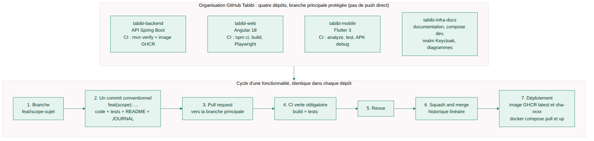

# Guide du développeur

> **Pourquoi ce document.** Pour qu'un développeur qui rejoint Tabibi soit productif le premier jour : installer,
> lancer et tester chaque dépôt, ajouter une fonctionnalité en respectant l'architecture, écrire un commit conforme,
> lire le journal. Les règles de contribution (branches, pull requests) sont dans [../CONTRIBUTING.md](../CONTRIBUTING.md).

## Sommaire

1. [Outils à installer](#1-outils-à-installer)
2. [Lancer l'environnement complet en local](#2-lancer-lenvironnement-complet-en-local)
3. [Backend : `tabibi-backend`](#3-backend--tabibi-backend)
4. [Web : `tabibi-web`](#4-web--tabibi-web)
5. [Mobile : `tabibi-mobile`](#5-mobile--tabibi-mobile)
6. [Ajouter une fonctionnalité : la liste de contrôle](#6-ajouter-une-fonctionnalité--la-liste-de-contrôle)
7. [Conventions de commit](#7-conventions-de-commit)
8. [Lire et tenir le journal](#8-lire-et-tenir-le-journal)
9. [Regénérer les diagrammes de ce dépôt](#9-regénérer-les-diagrammes-de-ce-dépôt)
10. [Tests d'intégration des trois briques](#10-tests-dintégration-des-trois-briques)

## 1. Outils à installer

| Outil | Version | Pour |
|---|---|---|
| Git | récent | tous les dépôts |
| Docker Engine + Compose v2 | récent | PostgreSQL et Keycloak en local, test d'intégration Testcontainers, images, pile d'intégration réelle (section 10) |
| JDK Temurin | 21 | backend |
| Maven | 3.9 | backend (`mvn`) |
| Node.js + npm | 20 | web |
| Chrome ou Chromium | récent | facultatif : `CHROME_BIN` évite de télécharger le Chromium de Playwright (web et `integration/web`) |
| Flutter SDK (canal stable) + Android Studio (SDK, émulateur) ; Xcode sur macOS | Flutter 3, Dart >= 3.5 | mobile |
| Mermaid CLI (`npm install -g @mermaid-js/mermaid-cli`) | 11 | diagrammes de ce dépôt (facultatif) |

## 2. Lancer l'environnement complet en local

```bash
git clone https://github.com/<org>/tabibi-infra-docs.git
git clone https://github.com/<org>/tabibi-backend.git
git clone https://github.com/<org>/tabibi-web.git
git clone https://github.com/<org>/tabibi-mobile.git

cd tabibi-infra-docs && docker compose up -d      # PostgreSQL 16 (5432) + Keycloak 26 (8081, realm tabibi importé)
cd ../tabibi-backend && mvn spring-boot:run        # API sur http://localhost:8080, données en mémoire
cd ../tabibi-web && npm install && npm start       # http://localhost:4200
cd ../tabibi-mobile && flutter pub get && flutter run   # émulateur Android (10.0.2.2 = machine hôte)
```

Le `docker-compose.yml` de ce dépôt et celui du backend sont équivalents (mêmes images, même realm monté) : lancer
l'un ou l'autre, pas les deux (mêmes ports). Keycloak : console `http://localhost:8081` (`admin` / `admin`).

**Comptes de démonstration** (realm de développement seulement, jamais en production) :

| Utilisateur | Mot de passe | Rôle |
|---|---|---|
| `patient.demo` | `patient` | PATIENT |
| `medecin.demo` | `medecin` | MEDECIN (identifiant du premier praticien de démonstration de l'annuaire en mémoire) |
| `secretaire.demo` | `secretaire` | SECRETAIRE (à rattacher par `medecin.demo`) |
| `pharmacie.demo` | `pharmacie` | PHARMACIE |
| `admin.demo` | `admin` | ADMIN |

Obtenir un jeton en ligne de commande (le client `tabibi-web` accepte le mot de passe direct **en dev seulement**) :

```bash
TOKEN=$(curl -s -X POST http://localhost:8081/realms/tabibi/protocol/openid-connect/token \
  -d client_id=tabibi-web -d grant_type=password -d username=medecin.demo -d password=medecin \
  | python3 -c 'import json,sys; print(json.load(sys.stdin)["access_token"])')
curl -s http://localhost:8080/api/moi -H "Authorization: Bearer $TOKEN"
```

## 3. Backend : `tabibi-backend`

```bash
mvn spring-boot:run                                          # profil par défaut : en mémoire, sans base
mvn spring-boot:run -Dspring-boot.run.profiles=postgres      # JPA + Liquibase sur le PostgreSQL de docker compose
mvn test                                                     # unitaires + tranches web (aucun service externe)
mvn verify -Dit.docker=true                                  # + test d'intégration PostgreSQL (Testcontainers, Docker requis)
docker build -t tabibi-backend .                             # image de production
```

- Swagger : `http://localhost:8080/swagger-ui.html`. Santé : `/actuator/health`.
- Variables utiles : `TABIBI_KEYCLOAK_ISSUER`, `TABIBI_CORS_ORIGINES`, `TABIBI_TELECONSULTATION_BASE_URL`,
  `TABIBI_RAPPELS_ACTIFS`, `SPRING_DATASOURCE_*` (voir le README du dépôt).
- Structure : un module par domaine, `domain/` (entités, ports, exceptions), `application/` (services),
  `adapter/` (contrôleur, repositories mémoire et JPA) ; voir [ARCHITECTURE.md](ARCHITECTURE.md).
- Tests (63 classes) : `src/test/java/dz/tabibi/backend/<module>/` : `*Test` sur le domaine (`AvisTest`,
  `TeleconsultationTest`, `ProfilTest`...), `*ServiceTest` (cas d'usage avec faux ports), `*WebTest`
  (`@WebMvcTest` + `SecurityConfig` : 401 sans jeton, 403 par rôle, codes HTTP), `JpaRendezVousRepositoryIT`
  (Testcontainers, activé par `-Dit.docker=true`), `SecuriteWebTest` et `CorsWebTest` (chaîne de sécurité),
  `RealmKeycloakTest` (le realm versionné est conforme).

## 4. Web : `tabibi-web`

```bash
npm install
npm start                                                    # ng serve, http://localhost:4200
npm run build && npm test                                    # le build de production, puis les 296 tests Playwright
npm test                                                     # les tests seuls (dist/ doit déjà exister)
npm run test:logique                                         # 39 tests de modules purs, dans node, sans navigateur
npm run test:navigateur                                      # 257 tests dans Chromium (dont 19 parcours)
npm run test:ui                                              # mode interactif : rejouer un test, inspecter le DOM
npx ng build                                                 # dist/tabibi-web/browser et server/server.mjs
npm run serve:ssr                                            # http://localhost:4000 : build de production rendu côté serveur
docker build -t tabibi-web . && docker run --rm -p 4200:80 -e TABIBI_API_URL=http://localhost:8080 \
  -e TABIBI_KEYCLOAK_ISSUER=http://localhost:8081/realms/tabibi tabibi-web      # image Node (SSR)
```

**Un seul outil de test navigateur dans tout le projet : Playwright.** Dans `tabibi-web` il ouvre le build de
production face à une API simulée (rapide, hors ligne, pas de Docker) ; dans ce dépôt, `integration/web` ouvre la même
application face à la **pile réelle** (section 10). Même outil, mêmes aides (`ouvrir()` qui attend l'hydratation),
mêmes traces à lire : un test écrit d'un côté se relit de l'autre.

- Configuration : `src/assets/config.json` (`apiUrl`, `keycloakIssuer`, `keycloakClientId`), lue par `ConfigService`
  avant le démarrage (côté serveur : `CONFIGURATION_SERVEUR` depuis `process.env`) ; remplacée au déploiement,
  jamais reconstruite. Le rendu côté serveur (`server.ts`) ne doit jamais dépendre de `window`, `localStorage` ni
  d'une minuterie : vérifier `isPlatformBrowser` avant d'en utiliser.
- Structure : un dossier par domaine avec un `*.service.ts` (HTTP) et des composants standalone ; `auth/` (OIDC,
  intercepteur, rôles, gardes) ; routes dans `app.routes.ts`.
- Tests : **aucun `*.spec.ts` sous `src/`** ; tout vit dans `tests/`, en deux projets Playwright — `tests/logique/`
  (modules sans import Angular : dictionnaires i18n, `*.formats.ts`) et `tests/navigateur/` + `tests/parcours/`
  (composants, appels HTTP, gardes de rôle, SEO, i18n rendue, parcours). Les aides de `tests/outils/` remplacent
  `TestBed` et `HttpTestingController` : `ouvrir` (attend l'hydratation), `connecter` (connexion simulée, rôles par
  `GET /api/moi`), `stub` (réponse à la place de l'API), `requetes` (journal des appels). Règle de conversion :
  chaque assertion doit avoir son équivalent **observable** à l'écran ou dans la requête envoyée.
- Garde-fous : `npm run verif:tests` échoue s'il reste une spec sous `src/` ou une dépendance de l'ancien outillage ;
  `npm run verif:i18n` refuse un libellé français littéral dans un template.

## 5. Mobile : `tabibi-mobile`

```bash
flutter pub get
flutter run                                                  # émulateur Android
flutter run --dart-define=TABIBI_API_URL=http://localhost:8080 \
            --dart-define=TABIBI_ISSUER=http://localhost:8081/realms/tabibi     # simulateur iOS
flutter analyze && flutter test
tool/preparer_android.sh && flutter build apk --debug        # projet Android généré et configuré (dz.tabibi.app)
```

- Configuration : `lib/config/configuration.dart` (`--dart-define`), client public `tabibi-mobile` (PKCE).
- Structure : `services/` (ApiService, AuthService, session), `models/`, `pages/`, `utils/`, `widgets/`.
- Tests : `test/*_test.dart` (modèles, utilitaires), `test/widget_test.dart` (pages avec `FakeApiService`).
- Les projets natifs `android/` et `ios/` ne sont pas versionnés (`flutter create .`).

## 6. Ajouter une fonctionnalité : la liste de contrôle

Exemple : « le patient peut noter la ponctualité d'un cabinet ». Suivre l'ordre : chaque étape a ses tests.

**Backend**

1. **Domaine** (`<module>/domain/`) : l'entité ou la valeur (record immuable), ses règles (validation au
   constructeur ou dans une méthode de fabrique, transitions d'état qui lèvent `TransitionInvalideException`),
   ses exceptions (`XIntrouvableException`, `XInvalideException`). Aucune annotation Spring. Tests du domaine.
2. **Port** (`<module>/domain/XRepository.java`) : l'interface, uniquement ce dont le cas d'usage a besoin
   (`enregistrer`, `parId`, `parPatient`...). Si la fonctionnalité doit prévenir quelqu'un, injecter le port
   `Notifieur` ; si elle libère un créneau, le port `AlerteCreneau`.
3. **Service** (`<module>/application/XService.java`) : le cas d'usage, `@Service`, `@Transactional` sur ce qui
   écrit, règle de propriétaire (`AccesRefuseException`), appels aux ports. Tests avec de faux ports (Mockito ou
   fakes en mémoire) : cas nominal, chaque refus (400, 403, 404, 409), notifications envoyées ou non.
4. **Adaptateurs sortants** (`<module>/adapter/`) : `EnMemoireXRepository` (profil par défaut) et
   `JpaXRepository` + `XEntity` + `XJpa` (profil `postgres`). Ajouter l'entité au test d'intégration si elle a des
   requêtes non triviales.
5. **Liquibase** : `src/main/resources/db/changelog/0NN-<sujet>.yaml` (table, index, contraintes d'unicité) et
   l'`include` dans `db.changelog-master.yaml`. `ddl-auto: validate` échoue si l'entité et le schéma divergent.
6. **Contrôleur** (`<module>/adapter/XController.java`) : `@RestController`, `@PreAuthorize` sur chaque méthode,
   corps `record` avec `@NotNull`, vue `record` **sans donnée personnelle superflue**, sujet du jeton par
   `jwt.getSubject()`. Nouveau chemin public ou administrateur : `SecurityConfig`. Nouvelle exception :
   `GestionErreursApi`. Tests `@WebMvcTest` : 401 sans jeton, 403 pour les autres rôles, codes de succès et d'erreur.
7. **README** du dépôt (tableau des endpoints, section fonctionnelle) et **`docs/JOURNAL.md`** (nouvelle version).
8. **Commit** unique `feat(<scope>): ...` avec tout ce qui précède.

**Web**

1. Service HTTP (`src/app/<domaine>/<domaine>.service.ts`) : URL sur `config.apiUrl`, types des vues, libellés.
2. Composant standalone, formulaire avec validation côté client **identique aux règles du backend**, messages
   d'erreur lus dans `{ erreur }`, redirection vers la connexion si nécessaire, garde de rôle si l'espace est réservé.
3. Route dans `app.routes.ts`, lien dans la barre de navigation (`AppComponent`) selon le rôle.
4. Tests Playwright : la requête réellement envoyée (`requetes(page)`), l'écran et ses messages d'erreur, la garde de rôle (`connecter` avec un rôle insuffisant) ; une fonction pure va dans `*.formats.ts` et se teste dans le projet `logique`.
5. README, `docs/JOURNAL.md`, commit `feat(<scope>-web): ...`.

**Mobile** (si la fonctionnalité concerne les patients)

1. `ApiService` (méthode, identifiants en `String`, `ApiException`), modèle `fromJson` tolérant, utilitaires de
   libellés et de dates.
2. Page (`lib/pages/`), entrée sur l'accueil (`RecherchePage`), bouton « Se connecter » sans jeton, 401 = déconnexion.
3. Tests (`test/`), `FakeApiService` étendu.
4. README, `docs/JOURNAL.md`, commit `feat(<scope>-mobile): ...`.

**Ce dépôt** : si la fonctionnalité change l'architecture (nouveau module, nouvelle table, nouveau flux), mettre à
jour les diagrammes (`docs/diagrammes/src`), [ARCHITECTURE.md](ARCHITECTURE.md), [FONCTIONNALITES.md](FONCTIONNALITES.md)
et [JOURNAL.md](JOURNAL.md).

## 7. Conventions de commit

Format conventionnel, en français **sans accents dans le message** (portabilité des outils), un commit par
fonctionnalité, corps qui explique le *pourquoi* et liste les vérifications faites :

```
type(scope): description courte a l'infinitif ou au nom

Pourquoi ce changement, ce qu'il apporte, les regles metier ajoutees,
les fichiers ou modules touches, ce qui a ete verifie (mvn test, npm test, flutter test).

Co-Authored-By: Claude Fable 5.1 <noreply@anthropic.com>
Claude-Session: https://claude.ai/code/session_01CCa1DaNUmAZsjfJadZhwzF
```

- **Types** : `feat` (fonctionnalité), `fix` (correctif), `docs`, `test`, `refactor`, `chore` (outillage), `build`
  (image, dépendances), `ci` (workflows).
- **Scopes** : le module ou l'écran (`rendezvous`, `teleconsultation`, `avis-web`, `dawini-mobile`, `keycloak`,
  `docker`, `securite`, `architecture`).
- **Trailers** : les deux lignes finales `Co-Authored-By` et `Claude-Session` sont ajoutées à l'identique quand le
  commit est produit avec l'assistant ; un commit écrit sans assistant ne les porte pas.
- Jamais de secret, de donnée personnelle ni de fichier généré (`target/`, `node_modules/`, `dist/`, `.env`,
  `infra/keycloak/production/`) dans un commit.

Le cycle complet (branche, pull request, CI verte, revue, squash) est décrit dans [../CONTRIBUTING.md](../CONTRIBUTING.md)
et illustré ci-dessous.



## 8. Lire et tenir le journal

- Chaque dépôt de code a son `docs/JOURNAL.md` : une section `## vX.Y.0 — Titre` par fonctionnalité (correctif :
  `vX.Y.1`), avec les endpoints ou écrans ajoutés, les règles métier, les tests. La version correspond à un commit
  `feat(...)` ou `fix(...)` ; `git log --format='%h %ad %s' --date=short` donne le hash en face.
- Ce dépôt fusionne les trois journaux dans [JOURNAL.md](JOURNAL.md), par ordre chronologique, avec le dépôt, la
  version et le hash : c'est la vue « produit » de l'avancement.
- Quand on ajoute une fonctionnalité : nouvelle section dans le journal du dépôt concerné **dans le même commit**,
  puis une ligne dans le journal global de ce dépôt (commit `docs(journal): ...`).
- Les numéros de version des journaux sont ceux du produit ; `pom.xml` (0.27.0), `package.json` du web (0.24.0) et
  `pubspec.yaml` (0.15.0+1) suivent aujourd'hui le journal de leur dépôt.

## 9. Regénérer les diagrammes de ce dépôt

Les sources Mermaid sont dans `docs/diagrammes/src/*.mmd`, les images dans `docs/images/*.png` (et `.svg`).

```bash
npm install -g @mermaid-js/mermaid-cli
docs/diagrammes/generer.sh                 # tous les diagrammes
docs/diagrammes/generer.sh contexte        # un seul
# Chromium hors du chemin standard ou conteneur sans bac à sable :
PUPPETEER_CONFIG=/chemin/pupp.json docs/diagrammes/generer.sh
```

Règles pour les diagrammes : thème commun (en-tête `%%{init ...}%%` de chaque fichier), aucun emoji, un diagramme
par idée (couper plutôt que densifier), vérifier le PNG après génération, commiter la source et les images ensemble.

## 10. Tests d'intégration des trois briques

**Pourquoi.** Les tests des dépôts sont unitaires ou simulés (`@WebMvcTest` avec un jeton factice, Playwright du web
devant une API simulée, `FakeApiService` sur mobile) : aucun ne prouve que l'API en conteneur, avec sa base PostgreSQL
migrée par Liquibase, accepte les jetons du vrai Keycloak et enchaîne les cas d'usage de bout en bout. Le dossier
`integration/` de ce dépôt le fait, avec les images et le realm de production, sans simulateur.

**Ce qu'il contient.**

| Fichier | Rôle |
|---|---|
| `integration/docker-compose.integration.yml` | `postgres:16-alpine`, `quay.io/keycloak/keycloak:26.0` (`start-dev --import-realm`, realm `../tabibi-backend/infra/keycloak/tabibi-realm.json` monté seul, `KC_HOSTNAME=http://localhost:8081`), API construite depuis `../tabibi-backend` (`build: context`, profil `postgres`, datasource `postgres:5432/tabibi`, émetteur `http://localhost:8081/realms/tabibi`, clés lues en interne sur `keycloak:8080`), ports 8080 et 8081 publiés, `healthcheck` sur chaque service |
| `integration/scenario-api.mjs` | scénario Node 20 sans dépendance (`fetch` natif) : attend `/actuator/health` et le realm, obtient les jetons par mot de passe (`grant_type=password`, client `tabibi-web`) de `medecin.demo`, `patient.demo`, `admin.demo`, puis déroule 21 étapes ; chaque étape affiche `OK` ou `ECHEC` et le script sort en erreur (code 1) au premier échec ; une étape dépose le résultat (médecin publié, rendez-vous, code de l'ordonnance) dans `FICHIER_RESULTAT`, sitôt l'ordonnance émise |
| `integration/lancer.sh` | `docker compose up -d --build`, attente de Keycloak et de l'API, scénario, journaux des conteneurs en cas d'échec, `down -v` ; expose `FICHIER_RESULTAT` (défaut `integration/resultat-scenario.json`), affiche son chemin avec `GARDER_LA_PILE=1` et l'efface quand la pile est détruite |
| `integration/verifier-web.sh` | lanceur mince des tests navigateur : lecture du résultat du scénario (`CODE_ORDONNANCE`), dépendances (`npm ci`), Chromium de Playwright si besoin, puis `npx playwright test` |
| `integration/web/` | les tests eux-mêmes : `package.json` (`@playwright/test` seul), `playwright.config.ts` (projet `chromium`, `baseURL` = `URL_WEB`, trace / capture / vidéo conservées en cas d'échec, **pas de `webServer`** : la pile est déjà lancée), `tests/outils.ts` (`ouvrir()` qui attend l'hydratation, `lireApi()` / `praticiens()` qui interrogent l'API réelle, `htmlRendu()` qui relit le HTML sans navigateur), `tests/pile-reelle.spec.ts` (10 tests) |
| `.github/workflows/integration.yml` | la CI qui enchaîne tout (voir plus bas) |

**Le parcours vérifié** (dans l'ordre) : jetons et émetteur ; `GET /api/moi` (sujet et rôle de chaque compte) ; 401
sans jeton ; le médecin ouvre un créneau (`POST /api/medecin/creneaux`, 201) **sans être dans l'annuaire** (en profil
`postgres` l'annuaire démarre vide : ouvrir un créneau n'exige pas d'y être publié) ; le patient voit le créneau ;
publication du médecin : `GET /api/medecins/{id}` répond 404, alors candidature (`POST /api/medecin/candidature`)
puis validation par `admin.demo` (`POST /api/admin/candidatures/{id}/valider`), fiche publique 200 et notification
« Candidature validee » ; l'annuaire public liste le médecin ; réservation (`POST /api/creneaux/{id}/reserver`, 201) ;
le créneau n'est plus proposé et une seconde réservation répond 409 `{ erreur }` ; `GET /api/rendezvous/mes` ;
notifications du patient (« Rendez-vous confirme ») et du médecin (« Nouveau rendez-vous ») ; le médecin honore ;
avis (`POST /api/avis`, 201, sans identifiant du patient dans la vue) ; synthèse publique sans jeton (l'avis y est,
anonyme) ; ordonnance (`POST /api/ordonnances`, 201) visible du patient ; vérification publique du code (200, 404 pour
un code inconnu) ; ordonnance imprimable (`GET /api/ordonnances/{id}/pdf`, backend v0.23.0 : `application/pdf`
commençant par `%PDF-`, étape sautée si l'API est antérieure) ; refus 403 du patient sur `/api/admin/statistiques` et sur `POST /api/medecin/creneaux`, 200 pour
l'administrateur.

**Lancer.**

```bash
# tabibi-backend cloné à côté de ce dépôt (../tabibi-backend) ; Docker, Compose v2, Node 20, curl
integration/lancer.sh                                  # 5 à 10 minutes la première fois (construction de l'image)
GARDER_LA_PILE=1 integration/lancer.sh                 # laisse la pile en route pour l'explorer (Swagger, Keycloak)
docker compose -f integration/docker-compose.integration.yml down -v      # puis l'arrêter
TABIBI_BACKEND_DIR=/chemin/tabibi-backend integration/lancer.sh           # sources ailleurs
node integration/scenario-api.mjs                      # le scénario seul, contre une pile déjà démarrée
```

Variables : `TABIBI_BACKEND_DIR` (défaut `../tabibi-backend` à côté de ce dépôt), `TABIBI_API_URL`
(`http://localhost:8080`), `TABIBI_KEYCLOAK_ISSUER` (`http://localhost:8081/realms/tabibi`), `TABIBI_ATTENTE_S`
(attente maximale du démarrage, 240 s). La pile publie les mêmes ports que le `docker-compose.yml` de développement :
arrêter celui-ci avant.

**Émetteur des jetons.** Keycloak inscrit dans chaque jeton l'URL par laquelle il est appelé, sauf si `KC_HOSTNAME`
la fixe : la pile la fixe à `http://localhost:8081`, l'API attend ce même émetteur et lit les clés de signature sur le
réseau interne (`keycloak:8080`), exactement comme `docker-compose.prod.yml` (émetteur public, clés en interne). Le
scénario vérifie la revendication `iss` de chaque jeton avant d'appeler l'API.

**Le scénario est rejouable** sur une pile conservée : la fiche déjà publiée est réutilisée, un nouveau créneau et
un nouveau rendez-vous sont créés, la synthèse compte un avis de plus. Il fonctionne aussi contre
`mvn spring-boot:run` (profil en mémoire, annuaire seedé : l'étape de candidature est alors sautée) avec le
`docker-compose.yml` de développement.

**Le front web face à la pile, dans un vrai navigateur.** L'image `tabibi-web` rend les pages publiques côté serveur
en appelant l'API par `TABIBI_API_URL`, depuis le conteneur ; `localhost:8080` n'y désigne l'hôte qu'avec le réseau de
l'hôte (`--network host`, Linux). `PORT=4200` évite le port 80 et correspond à l'origine autorisée par le realm et le
CORS. La vérification passe par **Playwright** : c'est le seul outil de test navigateur du projet, ici comme dans
`tabibi-web`.

```bash
GARDER_LA_PILE=1 integration/lancer.sh
docker build -t tabibi-web:integration ../tabibi-web
docker run -d --name tabibi-web-integration --network host -e PORT=4200 \
  -e TABIBI_API_URL=http://localhost:8080 -e TABIBI_KEYCLOAK_ISSUER=http://localhost:8081/realms/tabibi tabibi-web:integration
integration/verifier-web.sh                 # dépendances + Chromium si besoin, puis les 10 tests Playwright
docker rm -f tabibi-web-integration && docker compose -f integration/docker-compose.integration.yml down -v
```

Une fois les dépendances installées, les tests se relancent directement depuis `integration/web` :

```bash
cd integration/web
npm ci                                      # une seule fois (@playwright/test)
npx playwright install chromium             # une seule fois (--with-deps en CI, pour les bibliothèques système)
npm test                                    # les 10 tests
npx playwright test --list                  # ce qui serait exécuté, sans rien lancer
npx playwright test -g "recherche"          # un seul test
npx playwright test --headed --debug        # voir le navigateur, pas à pas
CHROME_BIN=/chemin/vers/chrome npm test     # un Chrome déjà installé au lieu du Chromium de Playwright
```

**Ce que ces dix tests vérifient**, à partir des **vraies données de l'API** (rien n'est codé en dur : la liste des
praticiens, leurs identifiants, leur spécialité et le résultat du filtre viennent de `GET /api/medecins`) :
`assets/config.json` sert l'URL de l'API et l'émetteur Keycloak de la pile ; l'accueil rendu côté serveur affiche
« Trouver un praticien » et chaque praticien de l'API (échec si l'annuaire est vide : le scénario API a-t-il tourné ?) ;
la fiche du premier praticien affiche son nom et sa spécialité ; la recherche par spécialité filtre la liste comme
l'API avec le même filtre ; `/verifier` refuse un code inconnu ; `/mes-rendez-vous` part vers le Keycloak réel
(`realms/tabibi` et `auth` dans l'URL) ou annonce la redirection ; `robots.txt` et `sitemap.xml` répondent et le plan
du site annonce la fiche du premier praticien ; la CSP autorise l'origine de l'API ; le sélecteur de langue bascule la
page en arabe (`dir="rtl"`, `lang="ar"`, titre arabe).

Variables : `URL_WEB` (`http://localhost:4200`), `URL_API` (`http://localhost:8080`), `ISSUER_KEYCLOAK`
(`http://localhost:8081/realms/tabibi`), `CHROME_BIN`, `FICHIER_RESULTAT` et `CODE_ORDONNANCE` — le code d'une
ordonnance réellement émise par `scenario-api.mjs`. **Il n'y a rien à fournir à la main** : le scénario dépose son
résultat (`{ medecinId, rendezVousId, ordonnanceId, codeOrdonnance, genereLe }`) dans `FICHIER_RESULTAT`
(défaut `integration/resultat-scenario.json`, jamais commité) et `verifier-web.sh` l'y lit avant d'appeler
Playwright ; une valeur déjà présente dans l'environnement l'emporte. Sans ce fichier ni cette variable — par exemple
en lançant les tests navigateur seuls — le cas du code **valide** de `/verifier` est sauté (`test.skip` avec le motif
affiché) ; le cas du code inconnu, lui, est toujours vérifié. Les anciens noms `TABIBI_WEB_URL`, `TABIBI_API_URL` et
`TABIBI_KEYCLOAK_ISSUER` restent acceptés.

**Lire un échec.** Playwright garde une trace, une capture et une vidéo de chaque test rouge :

```bash
cd integration/web
npx playwright show-report                            # le rapport HTML (playwright-report/)
npx playwright show-trace test-results/<test>/trace.zip   # la trace : DOM, réseau, console, pas à pas
ls test-results/<test>/                               # capture test-failed-1.png et vidéo video.webm
```

En CI, tout cela est publié en artefact `playwright-integration-web` (rapport + traces), succès comme échec :
télécharger l'artefact, le décompresser, puis `npx playwright show-report <dossier>`. Ni `node_modules`, ni
`playwright-report`, ni `test-results` ne sont commités (`integration/web/.gitignore`).

**En CI.** `.github/workflows/integration.yml` (push sur `main`, pull request, `workflow_dispatch`, chaque lundi
06:00 UTC ; 30 minutes au plus) clone ce dépôt puis `<org>/tabibi-backend` et `<org>/tabibi-web` à côté (`<org>` =
variable de dépôt `ORG_GITHUB`, sinon le propriétaire du dépôt ; secret `JETON_DEPOTS` si les dépôts de code sont
privés), exécute `lancer.sh` (pile conservée), construit et lance l'image web, installe les dépendances et le
Chromium de Playwright (cache npm sur `integration/web/package-lock.json`), exécute `verifier-web.sh`, publie le
rapport Playwright et les traces en artefact `playwright-integration-web` (toujours) et les journaux des conteneurs en
artefact `journaux-integration` en cas d'échec, puis détruit tout (`down -v`). Le badge du README
montre le dernier résultat. Ce que la CI prouve, et ne prouve pas, est détaillé dans
[DEPLOIEMENT.md](DEPLOIEMENT.md) (section 16).

**Ajouter une étape** : une fonction `etape('Libellé', async () => { ... })` avec `appelAttendu(méthode, chemin,
statut, { jeton, corps })` et `verifier(condition, message)` ; garder l'ordre du parcours (chaque étape s'appuie sur
l'état `etat` des précédentes) et ne jamais dépendre d'un compte autre que les trois comptes de démonstration.

**Ajouter un test navigateur** : un `test('libellé', async ({ page, request }) => { ... })` dans
`integration/web/tests/pile-reelle.spec.ts`, en ouvrant les pages avec `ouvrir(page, '/chemin')` (qui attend
l'hydratation : un clic fait trop tôt est perdu) et en construisant l'attente avec `lireApi()` ou `praticiens()`
plutôt qu'avec une valeur écrite dans le test — la pile est réelle, ses données changent à chaque exécution. Pour une
page qui doit être rendue **côté serveur**, relire le HTML avec `htmlRendu(request, chemin, marqueur)` : le
JavaScript n'a alors pas tourné.
